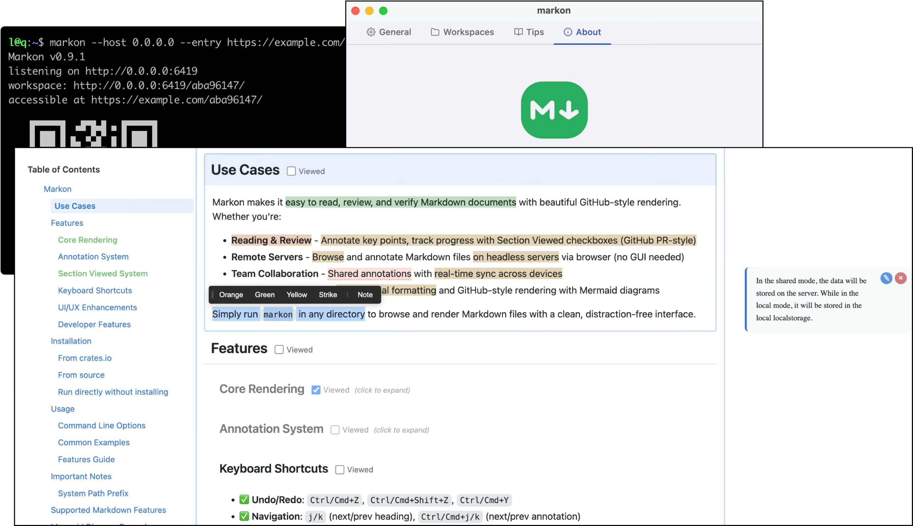

# Markon

A lightweight Markdown renderer with GitHub styling and Medium-like annotation features, written in Rust.



English | [简体中文](README.zh.md)

## Use Cases

Markon makes it easy to read, review, and verify Markdown documents with beautiful GitHub-style rendering. Whether you're:

- **Reading & Review** - Annotate key points, track progress with Section Viewed checkboxes (GitHub PR-style)
- **Remote Servers** - Browse and annotate Markdown files on headless servers via browser (no GUI needed)
- **Team Collaboration** - Shared annotations with real-time sync across devices
- **Printing & Presenting** - Professional formatting and GitHub-style rendering with Mermaid diagrams

Simply run `markon` in any directory to browse and render Markdown files with a clean, distraction-free interface.

## Features

### Core Rendering
- ✅ **GitHub Styling**: Complete GitHub Markdown CSS with dark/light/auto themes
- ✅ **Syntax Highlighting**: Powered by Syntect with 40+ languages
- ✅ **GitHub Alerts**: Support for NOTE, TIP, IMPORTANT, WARNING, CAUTION
- ✅ **Emoji Support**: Unicode emoji shortcodes (e.g., `:smile:` → 😄)
- ✅ **Mermaid Diagrams**: Flowcharts, sequence diagrams, pie charts, etc.
- ✅ **GFM Tables**: Full GitHub Flavored Markdown table support
- ✅ **Task Lists**: Interactive checkbox task lists
- ✅ **Print Optimization**: Professional print styles with multilingual font support
- ✅ **Auto TOC**: Auto-generated Table of Contents with smart scrolling
- ✅ **Directory Browsing**: Browse and select Markdown files in current directory
- ✅ **Mobile Friendly**: Responsive design with QR code for easy mobile access
- ✅ **Zero Dependencies**: Single binary with all resources embedded

### Annotation System
- ✅ **Text Highlighting**: Three colors (orange, green, yellow) for different purposes
- ✅ **Strikethrough**: Mark text as deleted or obsolete
- ✅ **Notes**: Attach comments to any highlighted text
- ✅ **Sidebar Cards**: Notes displayed in right sidebar (wide screen) with smart positioning
- ✅ **Popup Notes**: Notes shown as popups (narrow screen) near highlighted text
- ✅ **Click to Edit**: Click highlighted text to view/edit/delete notes
- ✅ **Clear Selection**: Select highlighted text again to remove highlight
- ✅ **Two Storage Modes**:
  - **Local Mode**: Browser LocalStorage (single device)
  - **Shared Mode**: SQLite + WebSocket (real-time multi-device sync)
- ✅ **Undo/Redo**: Full undo/redo support for all annotation operations

### Section Viewed System
- ✅ **GitHub PR-Style Checkboxes**: Mark sections as "Viewed" next to headings (H2-H6)
- ✅ **Auto-Collapse**: Checked sections automatically collapse
- ✅ **Click to Expand**: Toggle collapsed sections without changing viewed state
- ✅ **Batch Operations**: "All Viewed" and "Unviewed" toolbar after H1 heading
- ✅ **Visual Progress**: TOC items turn green when sections are viewed
- ✅ **Smart Folding**: Collapses content until next same/higher-level heading
- ✅ **Two Storage Modes**:
  - **Local Mode**: Browser LocalStorage (per-browser)
  - **Shared Mode**: SQLite + WebSocket (synced across devices)
- ✅ **Independent Toggle**: Expand/collapse without changing viewed status

### Section Print
- ✅ **Individual Print**: "Print" button next to each heading (H2-H6)
- ✅ **Precise Range**: Print only current section content (from heading to next same/higher-level heading)
- ✅ **Clean Output**: Automatically hide interactive elements (checkboxes, buttons) when printing
- ✅ **Preserve Styling**: Maintain GitHub-style professional formatting in print
- ✅ **One-Click Operation**: Click "Print" button to open system print dialog

### Keyboard Shortcuts
- ✅ **Undo/Redo**: `Ctrl/Cmd+Z`, `Ctrl/Cmd+Shift+Z`, `Ctrl/Cmd+Y`
- ✅ **Navigation**: `j/k` (next/prev heading), `Ctrl/Cmd+j/k` (next/prev annotation)
- ✅ **Smart Scroll**: `Space` (smooth 1/3 page scroll, `ESC` to stop)
- ✅ **TOC Control**: `Ctrl/Cmd+\` (toggle/focus TOC)
- ✅ **Section Control**: `o` (collapse/expand current section)
- ✅ **Viewed Control**: `v` (toggle current section viewed state)
- ✅ **Help Panel**: `?` (show all shortcuts)
- ✅ **Close/Cancel**: `ESC` (close popups, clear selection, cancel focus)
- ✅ **Platform Detection**: Auto-detects Mac vs Windows/Linux for modifier keys

### UI/UX Enhancements
- ✅ **Smart Popover**: Selection toolbar with auto-positioning (above/below)
- ✅ **Modal System**: Unified modal manager for notes and confirmations
- ✅ **Selection Overlay**: Visual selection highlight persists during note input
- ✅ **Focus Management**: Click outside markdown area clears section focus
- ✅ **Responsive Layout**: Adapts to wide screen (1400px+) and narrow screen modes
- ✅ **Note Positioning**: Smart positioning avoiding scrollbars and screen edges
- ✅ **Prevent Scroll**: Modal/popover focus doesn't trigger auto-scroll

### Developer Features
- ✅ **Modular Architecture**: Clean separation (managers, navigators, components, services)
- ✅ **Configuration System**: Centralized config with frozen constants
- ✅ **Logger Utility**: Structured logging for debugging
- ✅ **WebSocket Manager**: Auto-reconnect with exponential backoff
- ✅ **Storage Abstraction**: Strategy pattern for local vs shared storage
- ✅ **Event System**: Pub/sub for WebSocket and annotation changes

## Installation

### From crates.io

```bash
cargo install markon
```

### From source

```bash
cargo install --path .
```

### Run directly without installing

```bash
cargo run -- [OPTIONS] [FILE]
```

## Usage

**Quick Start**: `markon [FILE]` - Render a Markdown file or browse current directory.

### Command Line Options

```
Usage: markon [OPTIONS] [FILE]

Arguments:
  [FILE]  Markdown file to render (omit to browse current directory)

Options:
  -p, --port <PORT>                Server port [default: 6419]
  -t, --theme <THEME>              Theme: light, dark, auto [default: auto]
      --qr [<BASE_URL>]            Generate QR code (optional: custom URL)
  -b, --open-browser [<BASE_URL>]  Auto-open browser (optional: custom URL)
      --shared-annotation          Enable shared annotation via SQLite + WebSocket
      --enable-viewed              Enable section viewed checkboxes (GitHub PR-style)
  -h, --help                       Print help
  -V, --version                    Print version
```

### Common Examples

```bash
# Browse markdown files in current directory
markon

# Render specific file
markon README.md

# Custom port and dark theme
markon -p 8080 -t dark README.md

# QR code for mobile access
markon --qr http://192.168.1.100:6419

# Auto-open browser with custom URL (reverse proxy)
markon -b http://docs.example.com

# Enable shared annotations (multi-device sync)
markon --shared-annotation README.md

# Enable viewed feature (track reading progress)
markon --enable-viewed README.md

# Full-featured: QR + browser + shared + viewed
markon --qr -b --shared-annotation --enable-viewed README.md
```

### Features Guide

**Annotations**:
- Select text → Choose highlight/strikethrough/note from toolbar
- Local mode: Stored in browser LocalStorage
- Shared mode (`--shared-annotation`): SQLite database with real-time WebSocket sync
- Custom DB path: `MARKON_SQLITE_PATH=/path/to/db markon --shared-annotation`

**Section Viewed** (`--enable-viewed`):
- Check box next to heading → Section collapses
- Click "(click to expand)" → Temporarily view collapsed section
- Uncheck box → Section expands permanently
- Batch toolbar (after H1): "All Viewed" / "Unviewed" buttons
- Storage: LocalStorage (default) or SQLite (with `--shared-annotation`)

**Keyboard Shortcuts** (press `?` to see all):
- `Ctrl/Cmd+Z` / `Ctrl/Cmd+Shift+Z`: Undo/Redo annotations
- `j` / `k`: Next/Previous heading
- `Ctrl/Cmd+\`: Toggle TOC
- `v`: Toggle current section viewed (requires `--enable-viewed`)
- `ESC`: Close popups/Clear selection

## Important Notes

### System Path Prefix

Markon uses `/_/` as a reserved path prefix for all system resources (CSS, JavaScript, WebSocket, favicon). This ensures complete separation between system files and your content:

- **Reserved path**: `/_/` (only this specific prefix)
- **What this means**: Do NOT create a directory named `_` (single underscore) in your working directory root
- **What you CAN do**:
  - ✅ Create directories like `_build/`, `__pycache__/`, `_test/`, `_cache/` (different from `_`)
  - ✅ Create directories like `ws/`, `static/`, `css/`, `js/` (no conflict!)
  - ✅ Use any file or directory names that don't start with exactly `_/`

**Examples**:
```bash
# ❌ This will conflict with system paths
mkdir _              # Don't create a single-underscore directory
markon               # System uses /_/css/*, /_/js/*, etc.

# ✅ All of these are perfectly fine
mkdir _build         # URL: /_build/* (not /_/*)
mkdir __pycache__    # URL: /__pycache__/* (not /_/*)
mkdir ws             # URL: /ws/* (not /_/ws - different!)
mkdir static         # URL: /static/* (not /_/*)
```

**When using reverse proxy**: Make sure to configure your proxy to forward the `/_/` path. See [REVERSE_PROXY.md](REVERSE_PROXY.md) ([中文版](REVERSE_PROXY.zh.md)) for detailed configuration examples for Nginx, Caddy, Apache, and Traefik.

## Supported Markdown Features

- **Headings** (H1-H6)
- **Bold/Italic/Strikethrough**
- **Lists** (ordered/unordered)
- **Task Lists** (- [ ] / - [x])
- **Tables**
- **Code Blocks** (with syntax highlighting)
- **Block Quotes**
- **Links and Images**
- **Horizontal Rules**
- **Footnotes**
- **Emoji** (:emoji_name:)
- **Mermaid Diagrams**
- **GitHub Alerts** ([!NOTE], [!TIP], etc.)

## Mermaid Diagram Example

Markon supports Mermaid diagram rendering using \`\`\`mermaid code blocks:

\`\`\`markdown
\`\`\`mermaid
graph TD
    A[Start] --> B{Decision}
    B -->|Yes| C[Action 1]
    B -->|No| D[Action 2]
\`\`\`
\`\`\`

Supported diagram types:
- Flowcharts (graph/flowchart)
- Sequence Diagrams (sequenceDiagram)
- Pie Charts (pie)
- Gantt Charts (gantt)
- Class Diagrams (classDiagram)
- State Diagrams (stateDiagram)
- And more...

## Emoji Support

Use standard emoji shortcodes:

```markdown
:smile: :heart: :rocket: :tada: :sparkles:
```

Result: 😄 ❤️ 🚀 🎉 ✨

## GitHub Alerts Example

Create alert boxes using special blockquote syntax:

```markdown
> [!NOTE]
> This is a note.

> [!TIP]
> This is a helpful tip.

> [!IMPORTANT]
> This is important information.

> [!WARNING]
> This is a warning.

> [!CAUTION]
> This is a serious warning.
```

Supported types:
- **NOTE** (blue) - General information
- **TIP** (green) - Helpful tips or suggestions
- **IMPORTANT** (purple) - Key information
- **WARNING** (yellow) - Important warnings
- **CAUTION** (red) - Dangerous or critical warnings

## Tech Stack

### Backend
- **Markdown Parsing**: [pulldown-cmark](https://github.com/raphlinus/pulldown-cmark)
- **Syntax Highlighting**: [syntect](https://github.com/trishume/syntect)
- **HTTP Server**: [axum](https://github.com/tokio-rs/axum) + [tokio](https://tokio.rs/)
- **Template Engine**: [tera](https://github.com/Keats/tera)
- **Static Asset Embedding**: [rust-embed](https://github.com/pyrossh/rust-embed)
- **Emoji**: [emojis](https://github.com/rosetta-rs/emojis)

### Frontend
- **Diagram Rendering**: [Mermaid.js](https://mermaid.js.org/)
- **Styling**: [GitHub Markdown CSS](https://github.com/sindresorhus/github-markdown-css)
- **Architecture**: ES6 modules, OOP design, Strategy pattern

## Development

### Build

```bash
# Development build
cargo build

# Release build
cargo build --release

# Run tests
cargo test

# JavaScript lint
npx eslint assets/js/**/*.js

# Run
./target/debug/markon README.md
```

## Contributing

Contributions are welcome! Whether it's bug reports, feature requests, or code improvements.

### How to Contribute

1. **Report Issues**: Submit bugs or feature requests via [GitHub Issues](https://github.com/kookyleo/markon/issues)
2. **Submit PRs**:
   - Fork the repository
   - Create a feature branch (`git checkout -b feature/your-feature`)
   - Commit changes (`git commit -m 'Add your feature'`)
   - Push to branch (`git push origin feature/your-feature`)
   - Open a Pull Request

### Before Submitting PR

- Run `cargo test` - Ensure all tests pass
- Run `cargo clippy` - Check code quality
- Run `cargo fmt` - Format code
- Run `npx eslint assets/js/**/*.js` - Lint JavaScript code
- Test the changes manually

## License

Apache License 2.0

## Acknowledgments

- [go-grip](https://github.com/kookyleo/go-grip) - Initial inspiration for Markdown rendering
- [GitHub Markdown CSS](https://github.com/sindresorhus/github-markdown-css) - Styling source
- [Medium](https://medium.com) - Annotation feature inspiration
- All open-source contributors

## Links

- GitHub Markdown CSS: https://github.com/sindresorhus/github-markdown-css
- Mermaid documentation: https://mermaid.js.org/
- go-grip: https://github.com/kookyleo/go-grip
