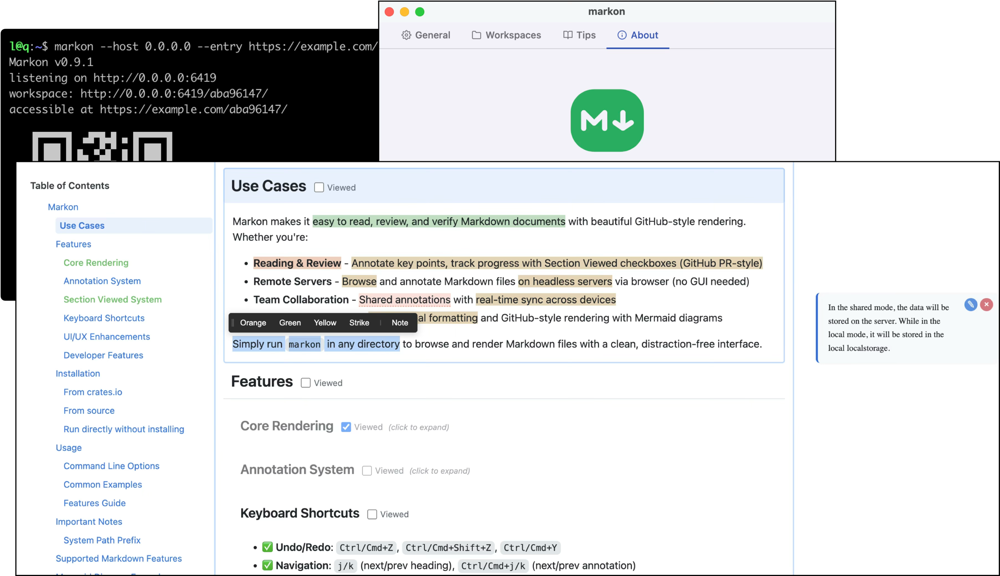

# Markon

Mark it on.

A local-first Markdown reading, review, and collaboration workbench. Markon turns a file or repository into a searchable browser workspace with GitHub-style rendering, annotations, section progress, editing, Git-aware diffs, and optional AI assistance.



English | [简体中文](README.zh.md) | [Documentation](https://kookyleo.github.io/markon/) | [Latest release](https://github.com/kookyleo/markon/releases/latest)

## What Markon Is

Markon is built for reading and reviewing Markdown, not just previewing it. It is useful when you need to:

- review a long design document with highlights, notes, and section progress;
- browse and search Markdown on a local machine or headless server;
- compare rendered Markdown across Git commits or working-tree changes;
- present a document while other devices follow the active section;
- edit a document without leaving the browser;
- ask an AI assistant to investigate workspace files and propose reviewable edits.

Markon is available as a Tauri desktop app for macOS, Windows, and Linux, and as a standalone CLI for terminal and server workflows.

## Highlights

| Area | Current capabilities |
| --- | --- |
| Rendering | GitHub-style light/dark themes, GFM tables and task lists, footnotes, alerts, emoji shortcodes, syntax highlighting, math, and server-rendered diagrams |
| Review | Text highlights, strikethrough, notes, undo/redo, section Viewed state, independent folding, focused section actions, page/section note export, and section/page printing |
| Navigation | Multi-workspace directory browser, tree expansion, generated TOC, Workspace Spotlight for file/content search, Chinese tokenization, and keyboard navigation |
| Editing | In-browser Markdown editor, source-position jumps from selected rendered text, save/reload, live file watching, and workspace path confinement |
| Collaboration | Local or shared annotations, SQLite + WebSocket sync, and Live broadcast/follow for section focus, selection, and Viewed state |
| AI Chat | Anthropic or OpenAI-compatible providers, workspace-scoped file tools and citations, multiple threads, popout/in-page modes, and approval-gated edits when Edit is enabled |
| Git | Branch/tag/ref browsing, recent history, working-tree and commit diffs, raw/rendered Markdown comparison, local checkout, and local commits |
| Desktop | Tray-resident multi-workspace manager, per-workspace feature flags, file associations, custom styles and shortcuts, and Stable/RC update channels |

Rendering, search, annotations, and persistence run locally. AI Chat is optional and sends the context it reads to the provider you configure; see [Data and privacy](#data-and-privacy).

## Installation

### Desktop App

Download the package for your platform from [GitHub Releases](https://github.com/kookyleo/markon/releases/latest):

| Platform | Packages |
| --- | --- |
| macOS | Apple Silicon and Intel `.dmg` |
| Windows | x64 and ARM64 NSIS installers |
| Linux | x64 and ARM64 `.deb` and `.AppImage` |

macOS users can install from the repository's Homebrew tap:

```bash
brew tap kookyleo/markon https://github.com/kookyleo/markon
brew install --cask markon
```

Windows users can install from the repository's Scoop bucket:

```powershell
scoop bucket add kookyleo https://github.com/kookyleo/markon
scoop install kookyleo/markon
```

The macOS app is ad-hoc signed and the Windows installer is not code-signed, so the first launch may show Gatekeeper or SmartScreen. See the [installation guide](docs/guide/installation.md) for the exact steps.

### CLI

Install the published CLI with Cargo:

```bash
cargo install markon
```

Or install it from a checkout:

```bash
git clone https://github.com/kookyleo/markon.git
cd markon
cargo install --path crates/cli
```

## Quick Start

### Desktop

1. Start Markon and add a directory from the Workspaces tab.
2. Open the workspace in the browser.
3. Enable Search, Viewed, Edit, Live, AI Chat, or Shared annotations per workspace.
4. Press `?` in a document to see the active shortcuts.

You can also open a `.md`/`.markdown` file with Markon. A single-file workspace is temporary, searches only that file, and exposes only the file plus explicitly referenced local assets inside its parent directory.

### CLI

```bash
# Open one file. A path causes Markon to open the browser automatically.
markon README.md

# Browse the current directory and explicitly open the browser.
markon -b

# Open a directory as another workspace.
markon docs/

# Inspect and manage the running service.
markon ls
markon set 1 edit on
markon detach 1
markon shutdown
```

The CLI uses one background server with multiple workspaces. The first invocation starts the daemon; later invocations register or update another workspace in the same server.

## CLI Reference

```text
markon [OPTIONS] [FILE]
markon <COMMAND>
```

### Main Options

| Option | Meaning |
| --- | --- |
| `[FILE]` | Markdown file or directory; defaults to the current directory |
| `-p, --port <PORT>` | Server port, default `6419` |
| `--host [IP]` | Bind address; no value opens an interface picker, `0.0.0.0` exposes all interfaces |
| `--entry, --qr [URL_PREFIX]` | Public URL prefix and QR target; without a value, uses the featured reachable URL |
| `-b, --open-browser [BASE_URL]` | Open the browser; an optional base URL supports reverse-proxy deployments |
| `--collaborator-access-code <CODE>` | Set or clear the remote collaborator gate for this workspace |
| `--print-collapsed-content` | Include collapsed section bodies in printed output |
| `--salt <SALT>` | Advanced override for workspace-ID generation |

### Commands

| Command | Purpose |
| --- | --- |
| `markon ls [--format cards\|table]` | List active workspaces and feature state |
| `markon detach <ID\|INDEX>` | Remove a workspace from the running server |
| `markon set <ID\|INDEX> <FEATURE> <on\|off>` | Toggle `search`, `viewed`, `edit`, `live`, `chat`, or `shared` |
| `markon shutdown` | Stop the background server |
| `markon bug` | Draft and open a GitHub bug report using authenticated `gh` |
| `markon idea` | Create a GitHub Discussion feature idea using `gh` |
| `markon ask` | Create a GitHub Discussions question using `gh` |

### Network Examples

```bash
# LAN access with a QR code based on the selected LAN address.
markon docs/ --host 0.0.0.0 --entry

# Bind one interface explicitly.
markon --host 192.168.1.5 docs/

# Advertise the public URL used by an HTTPS reverse proxy.
markon --entry https://docs.example.com docs/

# Gate remote visitors for this workspace. Loopback remains code-free.
markon --collaborator-access-code guest-secret docs/
```

See the complete [CLI guide](docs/guide/cli.md) and [reverse-proxy guide](REVERSE_PROXY.md).

## Workspace Model

Markon uses a single server with any number of workspace roots:

- Directory workspaces are persisted in `~/.markon/settings.json` and return after restart.
- Single-file workspaces are ephemeral and do not expose unrelated sibling files.
- Each workspace has an optional alias, collaborator code, and independent feature flags.
- New workspaces inherit the defaults from desktop General settings.
- Search and Viewed tracking are enabled by default; Edit, Live, AI Chat, and Shared annotations are opt-in by default.

### Feature Flags

| Flag | Effect |
| --- | --- |
| Search | Builds a Tantivy/Jieba index and enables Workspace Spotlight (`/` or `g`) |
| Viewed | Adds section progress and folding for H2-H6; section actions appear on the focused heading |
| Edit | Enables the Markdown editor and allows AI Chat to propose approval-gated file edits |
| Live | Enables Broadcast/Follow synchronized reading over WebSocket |
| AI Chat | Enables workspace-aware conversations using the configured provider |
| Shared annotations | Moves annotations and Viewed state from browser storage to SQLite and syncs them over WebSocket |

For Git repositories, the workspace page also exposes branches, tags, history, working changes, and rendered/raw Markdown diffs. Checkout, commit, file creation, and other structural actions are local-admin operations only.

## Access Model

Markon distinguishes access by network origin instead of user accounts:

- **Loopback is admin.** The desktop app and browser tabs on `127.0.0.1` can manage workspaces, change flags and aliases, edit files, and perform Git/file operations without an access code.
- **Remote clients are collaborators.** They can use only the capabilities enabled for that workspace and cannot perform structural/admin operations.
- **Collaborator codes gate remote access.** A workspace code overrides the global code; loopback always bypasses the gate.

The collaborator code is application-layer access control, not transport encryption. Put any public deployment behind HTTPS and a reverse proxy. Read [Access permissions](docs/features/access.md) and [Reverse proxy](REVERSE_PROXY.md) before exposing a server.

## Data and Privacy

| Data | Default location or behavior |
| --- | --- |
| Settings, workspace list, provider configuration | `~/.markon/settings.json` |
| Shared annotations, shared Viewed state, AI chat threads | `~/.markon/annotation.sqlite` |
| Local annotations and local Viewed state | Browser LocalStorage |
| Custom SQLite path | `MARKON_SQLITE_PATH=/path/to/annotation.sqlite` |
| Workspace access codes | Persisted as salted hashes, not plaintext |
| AI provider keys | Stored locally in `settings.json`; treat this file as sensitive |

Markon does not upload workspace contents for rendering, search, or annotations. AI Chat sends selected content, mentions, and tool-read context to the configured Anthropic or OpenAI-compatible endpoint. Its file tools are confined to the workspace, reject binary/oversized files, and cannot execute commands. When Edit is enabled, every proposed write waits for explicit Apply/Reject confirmation and an applied edit can be undone from the chat.

Uninstalling Markon does not remove `~/.markon` automatically.

## Markdown Support

Markon uses Supramark for parsing and diagram rendering. The current renderer covers:

- CommonMark/GFM headings, emphasis, links, images, raw HTML, lists, tables, task lists, blockquotes, and fenced code;
- footnotes, GitHub alerts, emoji shortcodes, syntax highlighting, and KaTeX math;
- Mermaid, PlantUML, D2, DOT/Graphviz, Vega/Vega-Lite, ECharts, and Chart.js diagrams;
- referenced local images, stylesheets, video, and audio within the workspace boundary;
- generated heading sections and a navigable table of contents.

See the [example workspace](example/) for executable rendering fixtures.

## Keyboard Shortcuts

Shortcuts can be customized in desktop settings. Press `?` for the authoritative list for the current page.

| Keys | Action |
| --- | --- |
| `?` / `t` | Shortcut help / theme panel |
| `/` or `g` | Open Workspace Spotlight |
| `j` / `k` | Next / previous heading |
| `Ctrl/Cmd+j` / `Ctrl/Cmd+k` | Next / previous annotation |
| `Ctrl/Cmd+\` | Toggle/focus the table of contents |
| `o` / `v` | Fold current section / toggle Viewed |
| `x` | Export this page's notes |
| `e` | Edit the current Markdown file |
| `l` / `Shift+L` | Cycle Live active mode / toggle Live off |
| `c` / `Shift+C` | Open AI Chat in the default / alternate surface |
| `m`, `n`, `p` | Toggle diff mode / next change / previous change on diff pages |
| `Ctrl/Cmd+z` / `Ctrl/Cmd+Shift+z` | Undo / redo annotations |
| `Esc` | Close the active layer or clear focus/selection |

## Development

Frontend assets are TypeScript bundles embedded by `markon-core`, so build them before compiling Rust from a fresh checkout:

```bash
npm install
npm run build
cargo build
```

Run the canonical quality gate before submitting changes:

```bash
scripts/quality-gate.sh
```

It runs Rust formatting, strict Clippy, Rust tests, TypeScript type checking/ESLint, and Vitest. Useful focused commands include:

```bash
npm run typecheck
npm test
cargo test
cargo clippy --all-targets --all-features -- -D warnings
```

For desktop development and macOS packaging:

```bash
scripts/dev-gui.sh
scripts/build-dmg.sh
```

### Repository Layout

| Path | Ownership |
| --- | --- |
| `crates/core` | HTTP server, renderer, search, persistence, Git, chat, browser assets |
| `crates/cli` | CLI and daemon lifecycle |
| `crates/gui` | Tauri 2 desktop shell and settings UI |
| `crates/xtask` | Build-time maintenance helpers |
| `docs` | VitePress documentation |
| `example` | Rendering and end-to-end fixtures |

Architecture and persistence invariants are documented in [ARCHITECTURE.md](ARCHITECTURE.md).

## Contributing

Issues and pull requests are welcome. Please keep changes scoped, add tests in proportion to risk, and run `scripts/quality-gate.sh` before opening a PR.

- [Issues](https://github.com/kookyleo/markon/issues)
- [Discussions](https://github.com/kookyleo/markon/discussions)
- [Release process](RELEASE.md)

## License

Copyright © 2025-present kookyleo. Licensed under [Apache License 2.0](LICENSE).

Redistributions and derivative works must preserve [`NOTICE`](NOTICE), the original copyright notices, and prominent notices for modified files as required by Apache-2.0 Section 4.

The `Markon` name and marks are owned by the author. Apache-2.0 does not grant permission to use those marks to identify or promote a derivative product.

## Acknowledgments

- [go-grip](https://github.com/kookyleo/go-grip) for the original rendering inspiration
- [GitHub Markdown CSS](https://github.com/sindresorhus/github-markdown-css) for the reading baseline
- [Supramark](https://github.com/kookyleo/supramark) for Markdown and diagram rendering
- All contributors
