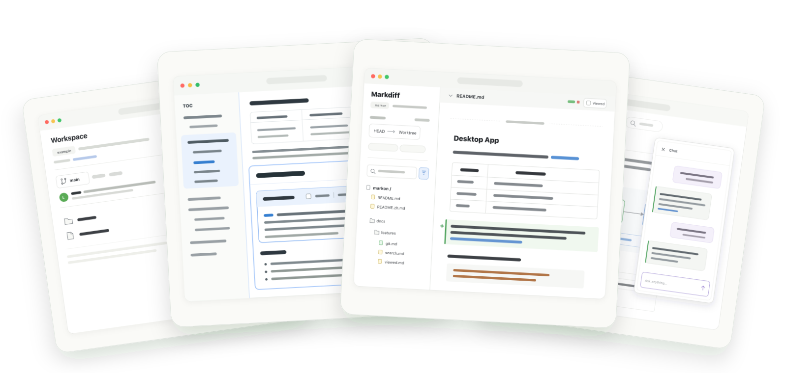

<p align="center">
  <picture>
    <source media="(prefers-color-scheme: dark)" srcset="docs/public/logo-dark.svg">
    
  </picture>
</p>

<h1 align="center">Markon</h1>

<p align="center"><strong>Help people and agents reach agreement in documents.</strong></p>

<p align="center">
  <a href="README.zh.md">简体中文</a> ·
  <a href="https://kookyleo.github.io/markon/">Product & documentation</a> ·
  <a href="https://kookyleo.github.io/markon/download">Download</a> ·
  <a href="https://github.com/kookyleo/markon/releases/latest">Releases</a>
</p>



Design does not arrive finished. It converges through reading, challenge, revision, and review. Markon brings local Markdown, folder context, and Git history into one workspace, so people and agents can examine the real text, improve it together, and focus each new review on what actually changed—until a Spec becomes shared ground.

<p align="center"><strong><a href="https://kookyleo.github.io/markon/">See how Markon fits into the full workflow →</a></strong></p>

## Features

- [**Markdown rendering**](https://kookyleo.github.io/markon/features/rendering) — GFM, Alerts, footnotes, Emoji, KaTeX, Mermaid, PlantUML, D2, Graphviz, Vega, and more.
- [**Workspace Spotlight**](https://kookyleo.github.io/markon/features/search) — search filenames, paths, headings, and body text across the workspace.
- [**Annotations & Notes**](https://kookyleo.github.io/markon/features/annotations) — highlight, strike through, comment, undo, redo, and export review notes.
- [**Viewed & folding**](https://kookyleo.github.io/markon/features/viewed) — track reading progress by Section and fold completed content.
- [**Git & Markdiff**](https://kookyleo.github.io/markon/features/git) — review working changes, commits, branches, and tags as rendered Markdown or raw source.
- [**Editing**](https://kookyleo.github.io/markon/features/edit) — jump from rendered text to Markdown source and edit beside the preview.
- [**Live**](https://kookyleo.github.io/markon/features/live) — synchronize Section focus, text selections, and Viewed state during a walkthrough.
- [**Shared annotations**](https://kookyleo.github.io/markon/advanced/shared-annotations) — keep annotations and reading progress synchronized across browsers.
- [**Workspace AI**](https://kookyleo.github.io/markon/features/chat) — investigate files, cite sources, and propose approval-gated edits.

## Get started

The desktop app supports macOS, Windows, and Linux and already includes the background service:

**[Download Markon](https://kookyleo.github.io/markon/download)**

For terminal and server workflows, install the CLI and daemon through Cargo:

```bash
cargo install markon markond

markon README.md   # open one document
markon docs/       # open a directory workspace
markon -b          # open the current directory
```

Continue with the [five-minute guide](https://kookyleo.github.io/markon/guide/getting-started), [installation notes](https://kookyleo.github.io/markon/guide/installation), or [CLI reference](https://kookyleo.github.io/markon/guide/cli).

## Data and privacy

Rendering, search, Git inspection, annotations, Viewed state, and Live run on the machine hosting Markon. Workspace AI is optional; only the context it reads is sent to the provider you configure. Its tools stay inside the workspace, cannot execute commands, and require approval for every proposed write. See [Data and privacy](https://kookyleo.github.io/markon/advanced/data-and-privacy) and [Access and permissions](https://kookyleo.github.io/markon/features/access) for the complete boundaries.

## Development

```bash
npm install
npm run build
cargo build

scripts/quality-gate.sh
```

Browser assets are TypeScript bundles embedded by `markon-core`. The quality gate runs Rust formatting, Clippy and tests together with TypeScript checks and Vitest. Architecture and persistence invariants are documented in [ARCHITECTURE.md](ARCHITECTURE.md).

## Project

- [Documentation](https://kookyleo.github.io/markon/)
- [Issues](https://github.com/kookyleo/markon/issues) and [Discussions](https://github.com/kookyleo/markon/discussions)
- [Release process](RELEASE.md)

Copyright © 2025-present kookyleo. Licensed under the [Apache License 2.0](LICENSE). Redistributions and derivative works must preserve [`NOTICE`](NOTICE) and the notices required by Apache-2.0 Section 4. The `Markon` name and marks remain the property of the author.

Built on [Supramark](https://github.com/kookyleo/supramark), with inspiration from [go-grip](https://github.com/kookyleo/go-grip) and [GitHub Markdown CSS](https://github.com/sindresorhus/github-markdown-css).
