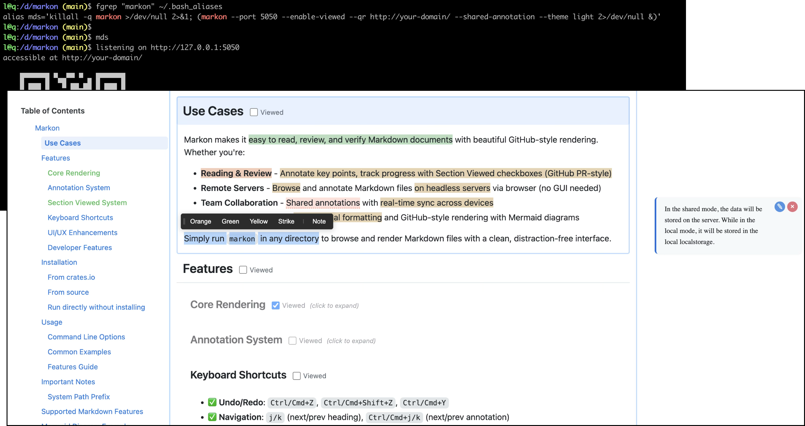

# Markon

A lightweight Markdown renderer with GitHub styling and Medium-like annotation features, written in Rust.



English | [简体中文](README.zh.md)

## Use Cases

Markon makes it easy to read, print, and annotate Markdown files in beautiful HTML format. Whether you're:

- **Reading documentation** on remote servers without a GUI
- **Reviewing and annotating** technical documents with highlights and notes
- **Printing** Markdown files with professional formatting
- **Presenting** Markdown content with GitHub-style rendering

Simply run `markon` in any directory to browse and render Markdown files with a clean, distraction-free interface.

## Features

### Core Features
- ✅ **GitHub Styling**: Complete GitHub Markdown CSS (dark/light themes)
- ✅ **Syntax Highlighting**: Powered by Syntect
- ✅ **GitHub Alerts**: Support for NOTE, TIP, IMPORTANT, WARNING, CAUTION
- ✅ **Emoji Support**: Unicode emoji shortcodes (e.g., `:smile:` → 😄)
- ✅ **Mermaid Diagrams**: Flowcharts, sequence diagrams, pie charts, etc.
- ✅ **Theme Switching**: Light, dark, and auto themes
- ✅ **Table Support**: GitHub Flavored Markdown (GFM) tables
- ✅ **Task Lists**: Checkbox task lists
- ✅ **Print Optimization**: Professional print styles with multilingual font support
- ✅ **Table of Contents**: Auto-generated TOC
- ✅ **Directory Browsing**: Auto-list Markdown files in current directory
- ✅ **Mobile Friendly**: Responsive design with QR code generation for easy mobile access
- ✅ **Zero Dependencies**: All resources embedded in a single binary

### Medium-Style Annotation Features
- ✅ **Text Highlighting**: Add orange, green, or yellow highlights to selected text
- ✅ **Strikethrough**: Mark text with strikethrough
- ✅ **Notes**: Add annotation notes to highlighted text
- ✅ **Sidebar Display**: Note cards displayed on the right side, linked to highlights
- ✅ **Unhighlight**: Remove highlights from selected text
- ✅ **Persistent Storage**: Annotation data saved in browser local storage

### Section Viewed Feature
- ✅ **GitHub PR-Style Checkboxes**: Mark sections as "Viewed" with checkboxes next to headings
- ✅ **Auto-Collapse**: Viewed sections automatically collapse to save space
- ✅ **Click to Expand**: Click collapsed headings to expand and uncheck
- ✅ **Persistent State**: Viewed states saved in LocalStorage per file
- ✅ **Smart Folding**: Collapses all content until next same-level or higher-level heading

## Installation

### From crates.io

```bash
cargo install markon
```

### From source

```bash
cargo install --path .
```

### Run directly without installing

```bash
cargo run -- [OPTIONS] [FILE]
```

## Usage

### Basic Usage

```bash
# Display list of Markdown files in current directory
markon

# Render a specific Markdown file
markon README.md

# Specify port
markon -p 8080 README.md

# Use dark theme
markon -t dark README.md

# Use light theme
markon -t light README.md

# Auto theme (based on system settings)
markon -t auto README.md
```

### Command Line Options

```
Usage: markon [OPTIONS] [FILE]

Arguments:
  [FILE]  The markdown file to render

Options:
  -p, --port <PORT>                The port to use for the server [default: 6419]
  -t, --theme <THEME>              Theme selection (light, dark, auto) [default: auto]
      --qr [<BASE_URL>]            Generate QR code for server address. Optionally specify a base URL (e.g., http://192.168.1.100:6419) to override the default local address
  -b, --open-browser [<BASE_URL>]  Automatically open browser after starting the server. Optionally specify a base URL (e.g., http://example.com:8080) to override the default local address
      --shared-annotation          Enable shared annotation mode. Annotations are stored in SQLite and synced across clients via WebSocket
      --enable-viewed              Enable section viewed checkbox feature (GitHub PR-style)
  -h, --help                       Print help
  -V, --version                    Print version
```

### Advanced Usage Examples

```bash
# Generate QR code for easy mobile access (uses local address)
markon --qr

# Generate QR code with a custom base URL (e.g., when using port forwarding or public IP)
markon --qr http://192.168.1.100:6419

# Auto-open browser after starting (opens local address)
markon -b

# Auto-open with custom base URL (useful when behind reverse proxy)
# Server listens on localhost:6419, but accessible via proxy at example.com
markon -b http://example.com

# Combine options: QR code + auto-open + dark theme
markon --qr -b -t dark README.md

# Complete example: Custom port, QR for public IP, auto-open local browser
markon -p 8080 --qr http://203.0.113.1:8080 -b

# Enable shared annotation mode for real-time collaboration
markon --shared-annotation README.md

# Enable section viewed feature (GitHub PR-style collapse)
markon --enable-viewed README.md

# Combine annotation and viewed features
markon --shared-annotation --enable-viewed README.md
```

**Understanding URL Parameters**:

Both `--qr` and `-b` options accept optional URL arguments:

**QR Code (`--qr` option)**:
- Without argument (`--qr`): Generates QR code for `http://127.0.0.1:6419` (local address)
- With base URL (`--qr <BASE_URL>`): Generates QR code for the specified URL
- Use cases:
  - **Port forwarding**: `--qr http://192.168.1.100:6419` (LAN IP)
  - **Public access**: `--qr http://example.com/docs` (public domain)
  - **Mobile access**: `--qr http://your-laptop-ip:6419` (for phones on same network)

**Open Browser (`-b` option)**:
- Without argument (`-b`): Opens `http://127.0.0.1:6419` (local address)
- With base URL (`-b <BASE_URL>`): Opens the specified URL instead
- Use cases:
  - **Reverse proxy**: Server on `localhost:6419`, proxy at `https://docs.example.com`
  - **SSH tunnel**: Remote server tunneled to `http://localhost:8080`
  - **Custom routing**: Any URL that points to your running server instance

### Using Annotation Features

1. Open a Markdown file in your browser
2. Select any text to see the toolbar
3. Choose highlight color (orange/green/yellow), strikethrough, or note
4. Notes will appear on the right side of the page
5. Click highlighted text to view associated notes
6. Select highlighted text again to unhighlight

#### Two Annotation Modes

**Local Mode (Default)**:
- Annotation data is stored in browser's LocalStorage
- Limited to a single browser, not shared across browsers or devices
- Suitable for personal reading and annotation
- No additional configuration needed

**Shared Mode (`--shared-annotation`)**:
- Annotation data is stored in a SQLite database (default path: `~/.markon/annotation.sqlite`)
- Supports real-time synchronization across multiple clients via WebSocket
- Suitable for various collaboration scenarios:
  - Single-user multi-device: Sync annotations across phone, tablet, desktop, etc.
  - Team collaboration: Multiple users can simultaneously view and edit annotations on the same document
- Custom database path can be set via `MARKON_SQLITE_PATH` environment variable

```bash
# Use shared annotation mode
markon --shared-annotation README.md

# Customize database location
MARKON_SQLITE_PATH=/path/to/annotations.db markon --shared-annotation README.md
```

In both modes, you can use the "Clear Annotations(mode) in this page" button at the bottom of the page to clear all annotations for the current page.

### Using Section Viewed Feature

The Section Viewed feature adds GitHub PR-style "Viewed" checkboxes to help you track your reading progress through long documents.

**How to Use**:

1. Start markon with `--enable-viewed` flag:
   ```bash
   markon --enable-viewed README.md
   ```

2. Each section heading (H2-H6) will have a "Viewed" checkbox on the right

3. **Check the box** to mark a section as viewed:
   - The section automatically collapses
   - Content is hidden until the next same-level or higher-level heading
   - The heading shows "(click to expand)" hint

4. **Click a collapsed heading** to expand it:
   - The section content becomes visible again
   - The "Viewed" checkbox is automatically unchecked

**Features**:

- ✅ **Persistent State**: Your viewed status is saved in browser LocalStorage per file
- ✅ **Smart Collapse**: Only collapses the current section, not subsections from other branches
- ✅ **Visual Feedback**: Collapsed sections are slightly dimmed and show expand hint
- ✅ **Keyboard Friendly**: Works with standard checkbox keyboard navigation

**Use Cases**:

- **Long Documentation**: Collapse sections you've already read
- **Code Review**: Similar to GitHub PR file review workflow
- **Study Materials**: Track your progress through tutorials
- **Technical Specs**: Hide completed sections while working through requirements

**Example Workflow**:

```bash
# Reading a long API documentation
markon --enable-viewed API_DOCS.md

# 1. Read "Authentication" section → Check "Viewed"
# 2. Read "Endpoints" section → Check "Viewed"
# 3. Working on "Rate Limiting" → Leave unchecked
# 4. Come back later → Previously viewed sections are still collapsed
# 5. Need to reference "Authentication" → Click to expand temporarily
```

## Important Notes

### System Path Prefix

Markon uses `/_/` as a reserved path prefix for all system resources (CSS, JavaScript, WebSocket, favicon). This ensures complete separation between system files and your content:

- **Reserved path**: `/_/` (only this specific prefix)
- **What this means**: Do NOT create a directory named `_` (single underscore) in your working directory root
- **What you CAN do**:
  - ✅ Create directories like `_build/`, `__pycache__/`, `_test/`, `_cache/` (different from `_`)
  - ✅ Create directories like `ws/`, `static/`, `css/`, `js/` (no conflict!)
  - ✅ Use any file or directory names that don't start with exactly `_/`

**Examples**:
```bash
# ❌ This will conflict with system paths
mkdir _              # Don't create a single-underscore directory
markon               # System uses /_/css/*, /_/js/*, etc.

# ✅ All of these are perfectly fine
mkdir _build         # URL: /_build/* (not /_/*)
mkdir __pycache__    # URL: /__pycache__/* (not /_/*)
mkdir ws             # URL: /ws/* (not /_/ws - different!)
mkdir static         # URL: /static/* (not /_/*)
```

**When using reverse proxy**: Make sure to configure your proxy to forward the `/_/` path. See [REVERSE_PROXY.md](REVERSE_PROXY.md) ([中文版](REVERSE_PROXY.zh.md)) for detailed configuration examples for Nginx, Caddy, Apache, and Traefik.

## Supported Markdown Features

- **Headings** (H1-H6)
- **Bold/Italic/Strikethrough**
- **Lists** (ordered/unordered)
- **Task Lists** (- [ ] / - [x])
- **Tables**
- **Code Blocks** (with syntax highlighting)
- **Block Quotes**
- **Links and Images**
- **Horizontal Rules**
- **Footnotes**
- **Emoji** (:emoji_name:)
- **Mermaid Diagrams**
- **GitHub Alerts** ([!NOTE], [!TIP], etc.)

## Mermaid Diagram Example

Markon supports Mermaid diagram rendering using \`\`\`mermaid code blocks:

\`\`\`markdown
\`\`\`mermaid
graph TD
    A[Start] --> B{Decision}
    B -->|Yes| C[Action 1]
    B -->|No| D[Action 2]
\`\`\`
\`\`\`

Supported diagram types:
- Flowcharts (graph/flowchart)
- Sequence Diagrams (sequenceDiagram)
- Pie Charts (pie)
- Gantt Charts (gantt)
- Class Diagrams (classDiagram)
- State Diagrams (stateDiagram)
- And more...

## Emoji Support

Use standard emoji shortcodes:

```markdown
:smile: :heart: :rocket: :tada: :sparkles:
```

Result: 😄 ❤️ 🚀 🎉 ✨

## GitHub Alerts Example

Create alert boxes using special blockquote syntax:

```markdown
> [!NOTE]
> This is a note.

> [!TIP]
> This is a helpful tip.

> [!IMPORTANT]
> This is important information.

> [!WARNING]
> This is a warning.

> [!CAUTION]
> This is a serious warning.
```

Supported types:
- **NOTE** (blue) - General information
- **TIP** (green) - Helpful tips or suggestions
- **IMPORTANT** (purple) - Key information
- **WARNING** (yellow) - Important warnings
- **CAUTION** (red) - Dangerous or critical warnings

## Project Origin

This project is a Rust port of [go-grip](https://github.com/kookyleo/go-grip) with added Medium-style annotation features.

### Key Differences from go-grip

| Feature | go-grip | markon |
|---------|---------|--------|
| Language | Go | Rust |
| GitHub Alerts | ✅ | ✅ |
| Emoji | Custom mapping | Unicode (emojis crate) |
| Medium Annotations | ❌ | ✅ |
| Hot Reload | ✅ | ❌ |
| Auto Browser Open | ✅ | ✅ |
| QR Code Generation | ❌ | ✅ |
| Print Optimization | ✅ | ✅ |

## Tech Stack

### Backend
- **Markdown Parsing**: [pulldown-cmark](https://github.com/raphlinus/pulldown-cmark)
- **Syntax Highlighting**: [syntect](https://github.com/trishume/syntect)
- **HTTP Server**: [axum](https://github.com/tokio-rs/axum) + [tokio](https://tokio.rs/)
- **Template Engine**: [tera](https://github.com/Keats/tera)
- **Static Asset Embedding**: [rust-embed](https://github.com/pyrossh/rust-embed)
- **Emoji**: [emojis](https://github.com/rosetta-rs/emojis)

### Frontend
- **Diagram Rendering**: [Mermaid.js](https://mermaid.js.org/)
- **Styling**: [GitHub Markdown CSS](https://github.com/sindresorhus/github-markdown-css)
- **Annotations**: Vanilla JavaScript + LocalStorage

## Development

### Project Structure

```
markon/
├── src/
│   ├── main.rs         # Entry point
│   ├── server.rs       # HTTP server
│   ├── markdown.rs     # Markdown renderer
│   └── assets.rs       # Static asset management
├── assets/
│   ├── css/            # Stylesheets
│   │   ├── github-markdown-dark.css
│   │   ├── github-markdown-light.css
│   │   ├── github-print.css
│   │   └── editor.css  # Annotation styles
│   ├── js/             # JavaScript
│   │   ├── mermaid.min.js
│   │   └── editor.js   # Annotation logic
│   └── templates/      # HTML templates
│       ├── layout.html
│       └── directory.html
├── Cargo.toml
├── README.md
└── README.zh.md
```

### Build

```bash
# Debug mode
cargo build

# Release mode
cargo build --release

# Run tests
cargo test

# Lint
cargo clippy

# JavaScript lint
npx eslint assets/js/editor.js
```

## Contributing

We welcome all forms of contributions! Whether it's reporting bugs, suggesting new features, or submitting code improvements.

### How to Contribute

1. **Report Issues**: Submit bug reports or feature requests in [GitHub Issues](https://github.com/kookyleo/markon/issues)
2. **Submit PRs**:
   - Fork the project
   - Create a feature branch (`git checkout -b feature/amazing-feature`)
   - Commit your changes (`git commit -m 'Add some amazing feature'`)
   - Push to the branch (`git push origin feature/amazing-feature`)
   - Open a Pull Request

### Code Standards

Before submitting a PR, please ensure:
- ✅ Run `cargo test` to ensure all tests pass
- ✅ Run `cargo clippy` to ensure code follows Rust best practices
- ✅ Run `cargo fmt` to format the code
- ✅ Run `npx eslint assets/js/editor.js` for JavaScript code

## License

Apache License 2.0

## Acknowledgments

- [go-grip](https://github.com/kookyleo/go-grip) - Original project
- [GitHub Markdown CSS](https://github.com/sindresorhus/github-markdown-css) - Styling source
- [Medium](https://medium.com) - Annotation feature inspiration
- All open-source contributors

## Links

- Original project: https://github.com/kookyleo/go-grip
- GitHub Markdown CSS: https://github.com/sindresorhus/github-markdown-css
- Mermaid documentation: https://mermaid.js.org/
