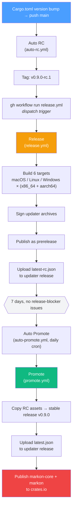
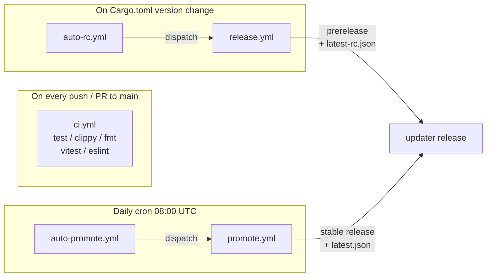
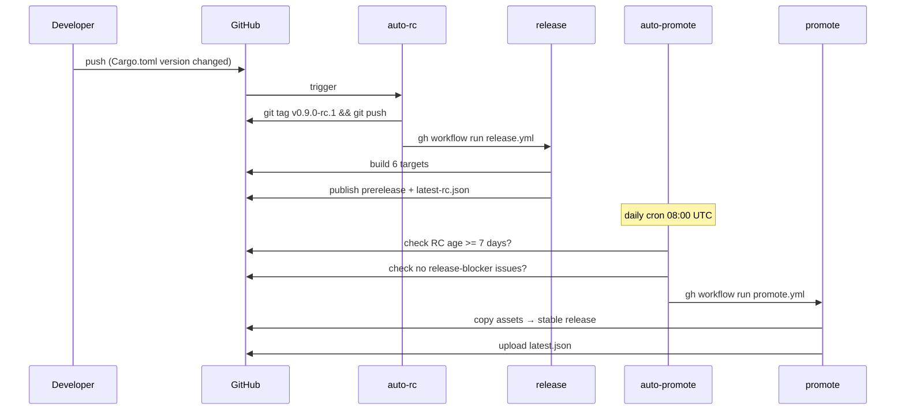
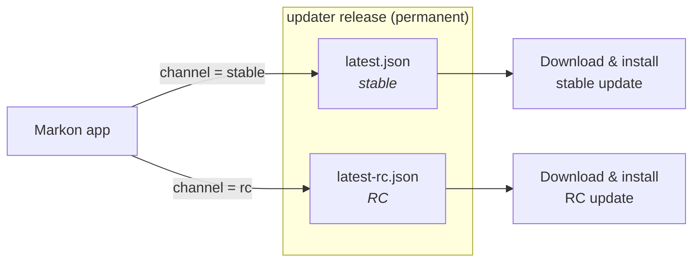

# Release Process

Markon uses a dual-channel (RC / Stable) release model with fully automated CI/CD pipelines.

## Overview



> **Why dispatch?** GitHub Actions' built-in `GITHUB_TOKEN` cannot trigger other
> workflows when it pushes a tag. Auto RC works around this by calling
> `gh workflow run release.yml` directly after creating the tag.

## Workflows



| Workflow | Trigger | Purpose |
|----------|---------|---------|
| `ci.yml` | Push / PR to main | test + clippy + fmt + vitest + eslint |
| `auto-rc.yml` | Push to main (Cargo.toml changed) | Detect version change → tag RC → dispatch Release |
| `release.yml` | `workflow_dispatch` or tag push `v*` | Build + sign + publish + upload updater manifest |
| `auto-promote.yml` | Daily cron 08:00 UTC + manual | Check RC age & blockers → dispatch Promote |
| `promote.yml` | `workflow_dispatch` (by auto-promote or manual) | Copy RC assets → create stable release → update manifest → publish to crates.io |

## How to Release

### 1. Bump version

Use the bump script — it runs all quality gates (fmt / clippy / tests / eslint)
with zero-warning enforcement before touching version fields. Any failure
aborts the bump, so the committed version is guaranteed to be on clean code.

```bash
scripts/bump-version.sh 0.10.0
git add -A && git commit -m 'chore: bump to 0.10.0' && git push
```

The script atomically updates:
- `Cargo.toml` → `workspace.package.version` (primary source of truth)
- `Cargo.toml` → `workspace.dependencies.markon-core.version` (MAJOR.MINOR range)
- `Cargo.lock` (via `cargo check`)

Once pushed to `main`, CI handles the rest.

> Manual edit works too (just edit `workspace.package.version` in `Cargo.toml`),
> but the script is recommended for consistency and quality enforcement.

### 2. What happens automatically



1. **auto-rc.yml** detects the version change, creates tag `v0.9.0-rc.1`, dispatches Release
2. **release.yml** builds all 6 targets (macOS / Linux / Windows, each in x86_64 and aarch64), signs updater archives, creates a prerelease, uploads `latest-rc.json` to the permanent `updater` release
3. **auto-promote.yml** runs daily at 08:00 UTC -- checks the latest RC against promotion criteria (see below), dispatches Promote if all pass
4. **promote.yml** copies all RC assets to a new stable release `v0.9.0` and uploads `latest.json`

### 3. Auto-promote criteria

All conditions must be met:

- RC is >= 7 days old
- No open issues with `release-blocker` label
- No stable release for the same version already exists

### 4. Blocking a release

Add the `release-blocker` label to any open GitHub issue to prevent auto-promotion. This is a manual decision -- when you see a critical bug report, add the label. Remove it (or close the issue) when the fix is in.

### 5. Manual override

Promote an RC immediately without waiting 7 days:

```bash
gh workflow run promote.yml -f rc_tag=v0.9.0-rc.1
```

Push a new RC (e.g. after a hotfix, version unchanged):

```bash
# auto-rc only triggers on version *change*, so for same-version re-RC:
git tag v0.9.0-rc.2
git push origin v0.9.0-rc.2
# Then manually trigger build:
gh workflow run release.yml -f tag=v0.9.0-rc.2
```

### 6. Publish to crates.io

Happens **automatically** at the end of `promote.yml` — after the stable
GitHub release is created, a `publish-crates` job publishes `markon-core`
and `markon` to crates.io in order, so users can `cargo install markon`.

Auto-publish requires the `CARGO_REGISTRY_TOKEN` secret to be set in the
GitHub repo settings. If the secret is absent, the job emits a warning and
skips publish (safe for forks / first-time setup). Re-runs are idempotent:
if a version is already on crates.io, the job treats it as success.

`markon-gui` is marked `publish = false` and is distributed only via GitHub Release.

**Manual publish** (e.g. outside the CI flow):

```bash
scripts/publish-crates.sh
```

Same steps as the CI job, but runs locally — useful for hotfixes or first
publish when CI isn't set up yet. Requires clean git tree and
`CARGO_REGISTRY_TOKEN` env (or prior `cargo login`).

## Update Channels

Clients check for updates from a permanent GitHub release tagged `updater`:

| Channel | Manifest | Audience |
|---------|----------|----------|
| **Stable** (default) | `updater/latest.json` | All users |
| **RC** | `updater/latest-rc.json` | Opt-in testers |

Users switch channels in Settings -> Preferences -> Update channel.



### Client update behavior

- When idle, the app checks the updater manifest for the configured channel
- If a newer version is found, it downloads and installs silently
- The About page shows "Update installed, restart to apply" with a "Restart now" link
- If the user doesn't restart, the update takes effect on the next app launch

## Signing

Updater packages are signed with a minisign keypair:

- **Public key**: embedded in `crates/gui/tauri.conf.json` -> `plugins.updater.pubkey`
- **Private key**: GitHub Secret `TAURI_SIGNING_PRIVATE_KEY` (no password)

To regenerate:

```bash
cargo tauri signer generate -w ~/.tauri/markon.key -p "" --ci
# Update pubkey in tauri.conf.json
# Update TAURI_SIGNING_PRIVATE_KEY secret
```

## Build Optimizations

- **Rust cache**: `Swatinem/rust-cache` caches dependencies across builds (7-day TTL)
- **cargo-binstall**: Downloads pre-built `tauri-cli` binary instead of compiling from source
- **Release profile**: `strip = true`, `lto = true`, `codegen-units = 1`, `opt-level = "s"`
