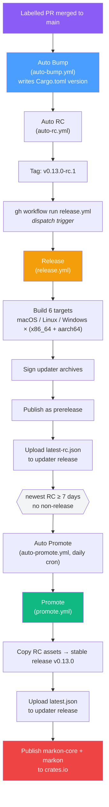
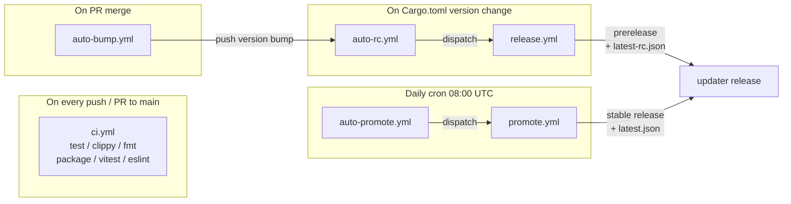
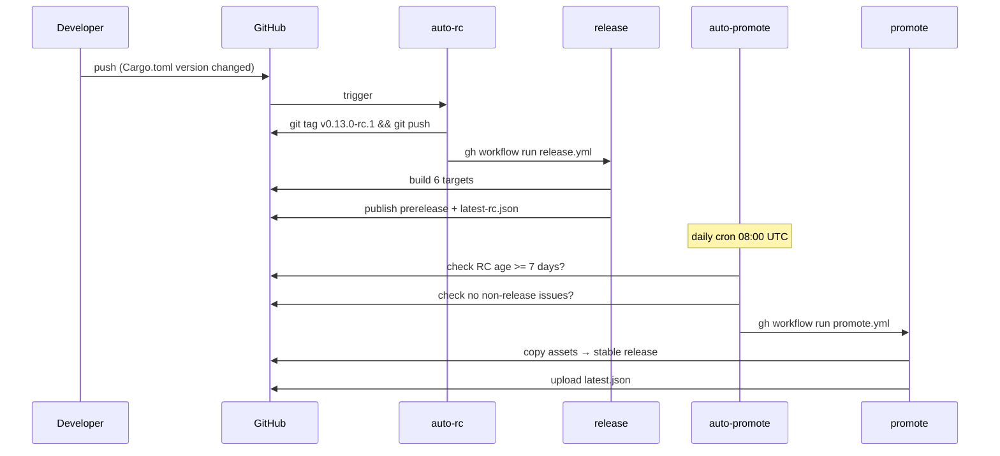
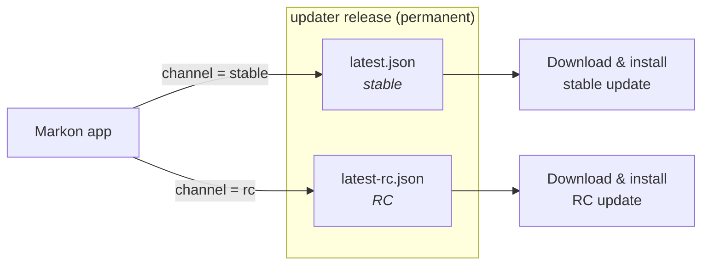

# Release Process

Markon uses a dual-channel (RC / Stable) release model with fully automated CI/CD pipelines.

## Overview


```mermaid
flowchart TD
    A0["Labelled PR merged to main"] --> A["Auto Bump<br/>(auto-bump.yml)<br/>writes Cargo.toml version"]
    A --> B["Auto RC<br/>(auto-rc.yml)"]
    B --> C["Tag: v0.13.0-rc.1"]
    C --> D["gh workflow run release.yml<br/><i>dispatch trigger</i>"]
    D --> E["Release<br/>(release.yml)"]
    E --> F["Build 6 targets<br/>macOS / Linux / Windows × (x86_64 + aarch64)"]
    F --> G["Sign updater archives"]
    G --> H["Publish as prerelease"]
    H --> I["Upload latest-rc.json<br/>to updater release"]

    I --> J{{"newest RC ≥ 7 days<br/>no non-release"}}
    J --> K["Auto Promote<br/>(auto-promote.yml, daily cron)"]
    K --> L["Promote<br/>(promote.yml)"]
    L --> M["Copy RC assets → stable release v0.13.0"]
    M --> N["Upload latest.json<br/>to updater release"]
    N --> P["Publish markon-core + markon<br/>to crates.io"]

    style A0 fill:#8b5cf6,color:#fff
    style A fill:#4a9eff,color:#fff
    style E fill:#f59e0b,color:#fff
    style L fill:#10b981,color:#fff
    style J fill:#f3f4f6,color:#333
    style P fill:#ef4444,color:#fff
```

> **Why dispatch?** GitHub Actions' built-in `GITHUB_TOKEN` cannot trigger other
> workflows when it pushes a tag. Auto RC works around this by calling
> `gh workflow run release.yml` directly after creating the tag.

## Workflows


```mermaid
graph LR
    subgraph "On every push / PR to main"
        CI["ci.yml<br/>test / clippy / fmt<br/>package / vitest / eslint"]
    end

    subgraph "On PR merge"
        AB["auto-bump.yml"]
    end

    subgraph "On Cargo.toml version change"
        RC["auto-rc.yml"] -->|dispatch| REL["release.yml"]
    end

    subgraph "Daily cron 08:00 UTC"
        AP["auto-promote.yml"] -->|dispatch| PR["promote.yml"]
    end

    AB -->|"push version bump"| RC
    REL -->|"prerelease<br/>+ latest-rc.json"| UP["updater release"]
    PR -->|"stable release<br/>+ latest.json"| UP
```

| Workflow | Trigger | Purpose |
|----------|---------|---------|
| `ci.yml` | Push / PR to main | test + clippy + fmt + package dry-run + vitest + eslint |
| `auto-bump.yml` | PR closed as merged into main | Read PR labels → bump `Cargo.toml` version → push to main |
| `auto-rc.yml` | Push to main (Cargo.toml changed) | Detect version change → tag RC → dispatch Release |
| `release.yml` | `workflow_dispatch` or tag push `v*` | Build + sign + publish + upload updater manifest |
| `auto-promote.yml` | Daily cron 08:00 UTC + manual | Check RC age & blockers → dispatch Promote |
| `promote.yml` | `workflow_dispatch` (by auto-promote or manual) | Copy RC assets → create stable release → update manifest → publish to crates.io |
| `docs.yml` | Push to main touching `docs/**` + stable `release` event | Build VitePress site and deploy to GitHub Pages |

## How to Release

### 1. Label the pull request

There is no bump command to run. Version numbers are never typed by hand —
`auto-bump.yml` derives them from the labels on the pull request you merge, so
the release decision lives on the PR and is visible in its history.

| Label | Effect on `0.15.19` | Use it for |
|-------|--------------------|------------|
| `semver:breaking` | → **`0.16.0`** | CLI flags removed or renamed, config/lock format changes, `markon-core` public API changes — anything an existing user has to react to |
| `semver:patch` | → **`0.15.20`** | Fixes, new features, dependency bumps. Identical to leaving the PR unlabelled; apply it to say "I looked, this really is a patch" |
| *(no label)* | → **`0.15.20`** | The default, so bot-opened PRs (Dependabot and friends) never stall the pipeline |
| `release:skip` | **no change, no release** | Docs-only, CI-only, test-only changes that nobody needs a build for |

`release:skip` beats `semver:breaking`, which beats everything else.

**Pre-1.0 mapping.** While the major version is `0`, a breaking change bumps the
*minor* — `0.15.19 → 0.16.0`, not `1.0.0` — because major `0` already signals
"no stability promise". Features and fixes both land on the patch position.
This mapping has to be revisited when the project reaches `1.0`.

> **`release:skip` matters more than it looks.** Because unlabelled defaults to
> patch, *every* merged PR otherwise cuts a release — a typo fix in a README
> included. Label the no-op changes.

Merging the PR is the whole ritual. `auto-bump.yml` then rewrites
`workspace.package.version` (and the `markon-core` `MAJOR.MINOR` dependency
range when the minor moves), refreshes `Cargo.lock` via `cargo metadata`, and
opens a `chore: bump to <version>` pull request on a `release/bump-<version>`
branch with auto-merge armed. It merges itself as soon as the required checks
pass, and that merge is the push `auto-rc.yml` is waiting for.

> **Nothing writes to main directly.** Not the bump, not the tap refresh, not
> an administrator. Branch protection is configured with *include
> administrators* on, so every change — human or bot — arrives through a pull
> request that has cleared the required checks. `RELEASE_PUSH_TOKEN` is still
> needed, but not to bypass anything: a pull request opened with the built-in
> `GITHUB_TOKEN` does not trigger CI, so auto-merge would sit forever waiting
> on checks that never start. The PAT only makes the PR look like it came from
> a person.

> **The bump PR is labelled `release:skip`,** and `auto-bump.yml` additionally
> ignores any merged branch whose name starts with `release/`. Without that,
> merging a version bump would trigger a version bump, forever.

### 2. What happens automatically


```mermaid
sequenceDiagram
    participant Dev as Developer
    participant GH as GitHub
    participant RC as auto-rc
    participant Rel as release
    participant AP as auto-promote
    participant Prom as promote

    Dev->>GH: push (Cargo.toml version changed)
    GH->>RC: trigger
    RC->>GH: git tag v0.13.0-rc.1 && git push
    RC->>Rel: gh workflow run release.yml
    Rel->>GH: build 6 targets
    Rel->>GH: publish prerelease + latest-rc.json

    Note over AP: daily cron 08:00 UTC
    AP->>GH: check RC age >= 7 days?
    AP->>GH: check no non-release issues?
    AP->>Prom: gh workflow run promote.yml
    Prom->>GH: copy assets → stable release
    Prom->>GH: upload latest.json
```

1. **auto-rc.yml** detects the version change, creates tag `v0.13.0-rc.1`, dispatches Release
2. **release.yml** builds all 6 targets (macOS / Linux / Windows, each in x86_64 and aarch64), signs updater archives, creates a prerelease, uploads `latest-rc.json` to the permanent `updater` release
3. **auto-promote.yml** runs daily at 08:00 UTC -- picks the newest RC past the 7-day soak window and checks promotion criteria (see below), dispatches Promote if all pass
4. **promote.yml** copies all RC assets to a new stable release `v0.13.0` and uploads `latest.json`

### 3. Auto-promote criteria

Each day, pick the **newest RC that is at least 7 days old** and promote it if:

- It is newer than the current latest stable (no downgrade, no re-publish)
- No open issue has the `non-release` label

> Newest *matured* RC, not the absolute newest: otherwise, under rapid releases the newest RC is never 7 days old and crates.io stalls on an old version (this stalled the whole 0.13.x line for a month). See the `auto-promote.yml` comments for the full rationale.

### 4. Blocking a release

Add the `non-release` label to any open GitHub issue to prevent auto-promotion. This is a manual decision -- when you see a critical bug report, add the label. Remove it (or close the issue) when the fix is in.

### 5. Manual override

Promote an RC immediately without waiting 7 days:

```bash
gh workflow run promote.yml -f rc_tag=v0.13.0-rc.1
```

Push a new RC (e.g. after a hotfix, version unchanged):

```bash
# auto-rc only triggers on version *change*, so for same-version re-RC:
git tag v0.13.0-rc.2
git push origin v0.13.0-rc.2
# Then manually trigger build:
gh workflow run release.yml -f tag=v0.13.0-rc.2
```

### 6. Publish to crates.io

Happens **automatically** at the end of `promote.yml` — after the stable
GitHub release is created, a `publish-crates` job publishes `markon-core`
and `markon` to crates.io in order, so users can `cargo install markon`.

Auto-publish requires the `CARGO_REGISTRY_TOKEN` secret to be set in the
GitHub repo settings. If the secret is absent, the job emits a warning and
skips publish (safe for forks / first-time setup). Re-runs are idempotent:
if a version is already on crates.io, the job treats it as success.

`markon-gui` is marked `publish = false` and is distributed only via GitHub Release.

There is no local publish script. `promote.yml` is the only path to crates.io,
so a release cannot be published from a working tree that CI never saw. To
re-run a failed publish, re-run that workflow — it is idempotent.

### 7. Homebrew / Scoop auto-update

`Casks/markon.rb` (Homebrew) and `bucket/markon.json` (Scoop) live in this repo
and double as the personal taps. On a stable promote, `promote.yml` bumps their
version + installer SHAs and commits them back to `main`.

The update goes up as a `release/taps-<version>` pull request with auto-merge
armed, labelled `release:skip` so refreshing the taps does not cut yet another
version. It needs the **`RELEASE_PUSH_TOKEN`** secret — a PAT (fine-grained,
`Contents: Read and write` plus `Pull requests: Read and write`) — because a PR
opened with the built-in `GITHUB_TOKEN` never triggers CI and would never
auto-merge. If the secret is absent the update is skipped with a warning (no
job failure).

`auto-bump.yml` uses the same secret for the same reason, but does **not** skip
on absence: no token there means no version change, hence no RC and no release
at all, so the job fails loudly instead of going quiet.

## Update Channels

Clients check for updates from a permanent GitHub release tagged `updater`:

| Channel | Manifest | Audience |
|---------|----------|----------|
| **Stable** (default) | `updater/latest.json` | All users |
| **RC** | `updater/latest-rc.json` | Opt-in testers |

Users switch channels in Settings -> Preferences -> Update channel.


```mermaid
flowchart LR
    subgraph "updater release (permanent)"
        LJ["latest.json<br/><i>stable</i>"]
        LR["latest-rc.json<br/><i>RC</i>"]
    end

    APP["Markon app"] -->|"channel = stable"| LJ
    APP -->|"channel = rc"| LR
    LJ --> DL1["Download & install<br/>stable update"]
    LR --> DL2["Download & install<br/>RC update"]
```

### Client update behavior

- When idle, the app checks the updater manifest for the configured channel
- If a newer version is found, it downloads and installs silently
- The About page shows "Update installed, restart to apply" with a "Restart now" link
- If the user doesn't restart, the update takes effect on the next app launch

## Signing

Updater packages are signed with a minisign keypair:

- **Public key**: embedded in `crates/gui/tauri.conf.json` -> `plugins.updater.pubkey`
- **Private key**: GitHub Secret `TAURI_SIGNING_PRIVATE_KEY` (no password)

To regenerate:

```bash
cargo tauri signer generate -w ~/.tauri/markon.key -p "" --ci
# Update pubkey in tauri.conf.json
# Update TAURI_SIGNING_PRIVATE_KEY secret
```

## Build Optimizations

- **Rust cache**: `Swatinem/rust-cache` caches dependencies across builds (7-day TTL)
- **cargo-binstall**: Downloads pre-built `tauri-cli` binary instead of compiling from source
- **Release profile**: `strip = true`, `lto = true`, `codegen-units = 1`, `opt-level = "s"`
