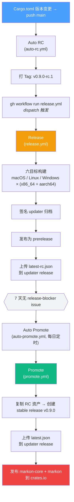
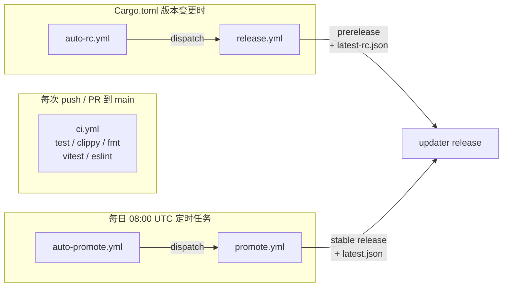
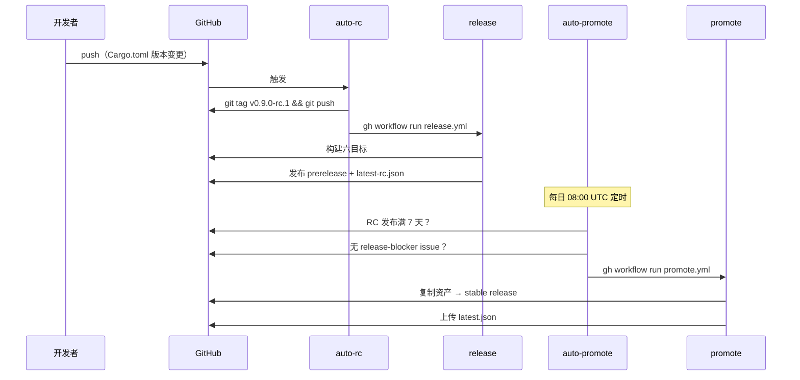
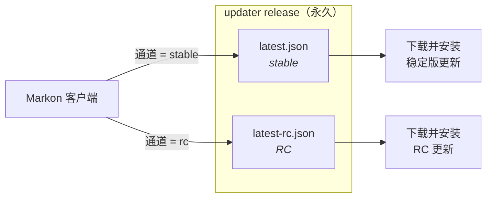

# 发布流程

Markon 采用双通道（RC / Stable）发布模型，全流程 CI/CD 自动化。

## 总览



> **为什么用 dispatch？** GitHub Actions 内置的 `GITHUB_TOKEN` 推送 tag 时不会触发其他 workflow。
> Auto RC 通过 `gh workflow run release.yml` 直接调用来绕过这一限制。

## Workflow 一览



| Workflow | 触发方式 | 用途 |
|----------|---------|------|
| `ci.yml` | push / PR 到 main | test + clippy + fmt + vitest + eslint |
| `auto-rc.yml` | push main 且 Cargo.toml 变更 | 检测版本变化 → 打 RC tag → 触发 Release |
| `release.yml` | `workflow_dispatch` 或 tag push `v*` | 构建 + 签名 + 发布 + 上传 updater manifest |
| `auto-promote.yml` | 每日 08:00 UTC 定时 + 手动 | 检查 RC 时间和 blocker → 触发 Promote |
| `promote.yml` | `workflow_dispatch`（由 auto-promote 或手动触发） | 复制 RC 资产 → 创建 stable release → 更新 manifest → 发布到 crates.io |

## 如何发布

### 1. 修改版本号

使用 bump 脚本——它在更新版本前强制运行所有质量门（fmt / clippy / 测试 / eslint），
零 warning 策略。任何一步失败则中止，确保提交的版本号对应的一定是干净代码。

```bash
scripts/bump-version.sh 0.10.0
git add -A && git commit -m 'chore: bump to 0.10.0' && git push
```

脚本原子更新：
- `Cargo.toml` → `workspace.package.version`（主版本来源）
- `Cargo.toml` → `workspace.dependencies.markon-core.version`（MAJOR.MINOR 范围）
- `Cargo.lock`（通过 `cargo check`）

推送到 `main` 后，CI 自动完成后续所有步骤。

> 也可以手动编辑（只需修改 `Cargo.toml` 中的 `workspace.package.version`），
> 但推荐使用脚本以保证一致性和质量门。

### 2. 自动化流程



1. **auto-rc.yml** 检测版本变化，创建 tag `v0.9.0-rc.1`，dispatch 触发 Release
2. **release.yml** 构建六目标（macOS / Linux / Windows 各自 x86_64 + aarch64），签名 updater 归档，创建 prerelease，上传 `latest-rc.json` 到永久的 `updater` release
3. **auto-promote.yml** 每天 08:00 UTC 运行，检查最新 RC 是否满足晋升条件（见下），满足则 dispatch 触发 Promote
4. **promote.yml** 复制 RC 全部资产到新的 stable release `v0.9.0`，上传 `latest.json`

### 3. 自动晋升条件

以下条件必须全部满足：

- RC 发布已满 7 天
- 没有标记 `release-blocker` 标签的 open issue
- 同版本号的 stable release 尚不存在

### 4. 阻止发布

给任意 open issue 添加 `release-blocker` 标签即可阻止自动晋升。这是手动决策——发现严重 bug 时添加，修复后移除标签（或关闭 issue）。

### 5. 手动操作

跳过 7 天等待，立即晋升：

```bash
gh workflow run promote.yml -f rc_tag=v0.9.0-rc.1
```

同版本发新 RC（如 hotfix 后版本号不变）：

```bash
# auto-rc 仅在版本号变更时触发，同版本需手动打 tag：
git tag v0.9.0-rc.2
git push origin v0.9.0-rc.2
# 然后手动触发构建：
gh workflow run release.yml -f tag=v0.9.0-rc.2
```

### 6. 发布到 crates.io

在 `promote.yml` 晋升 stable 后**自动触发**——创建完 GitHub stable release，
末尾的 `publish-crates` job 按顺序将 `markon-core` 和 `markon` 发布到 crates.io，
用户即可通过 `cargo install markon` 安装。

需要在 GitHub 仓库 Secrets 中配置 `CARGO_REGISTRY_TOKEN`。未配置时 job 会发出
warning 并跳过（不影响 release 本身，方便 fork 和首次配置）。重跑幂等：
如果版本已在 crates.io 上，job 视为成功。

`markon-gui` 标记了 `publish = false`，仅通过 GitHub Release 分发。

**手动发布**（如热修复或首次 CI 未就绪时）：

```bash
scripts/publish-crates.sh
```

流程与 CI job 一致，本地运行。需要 git 工作区干净 +
`CARGO_REGISTRY_TOKEN` 环境变量（或提前 `cargo login`）。

## 更新通道

客户端从 GitHub 上一个固定的 `updater` release 检查更新：

| 通道 | Manifest 文件 | 受众 |
|------|-------------|------|
| **Stable**（默认） | `updater/latest.json` | 所有用户 |
| **RC** | `updater/latest-rc.json` | 尝鲜测试用户 |

用户在 设置 -> 偏好设置 -> 更新通道 中切换。



### 客户端更新行为

- 应用空闲时检查对应通道的 updater manifest
- 发现新版本后自动下载并安装
- 关于页面显示"更新完成，重启生效"及"立即重启"链接
- 用户不重启的话，更新在下次启动时生效

## 签名

Updater 包使用 minisign 密钥对签名：

- **公钥**：内嵌在 `crates/gui/tauri.conf.json` -> `plugins.updater.pubkey`
- **私钥**：GitHub Secret `TAURI_SIGNING_PRIVATE_KEY`（无密码）

重新生成：

```bash
cargo tauri signer generate -w ~/.tauri/markon.key -p "" --ci
# 更新 tauri.conf.json 中的 pubkey
# 更新 GitHub Secret TAURI_SIGNING_PRIVATE_KEY
```

## 构建优化

- **Rust 缓存**：`Swatinem/rust-cache` 跨构建缓存依赖（7 天 TTL）
- **cargo-binstall**：直接下载预编译的 `tauri-cli`，跳过源码编译
- **Release profile**：`strip = true`、`lto = true`、`codegen-units = 1`、`opt-level = "s"`
