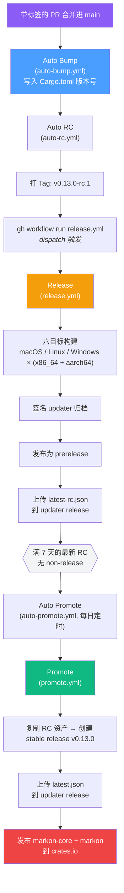
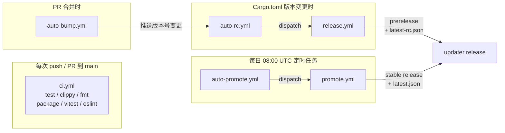
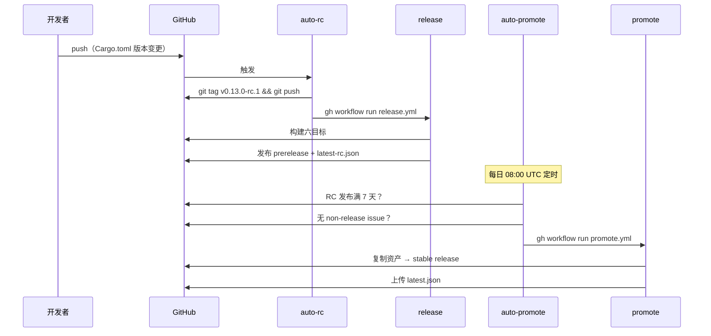
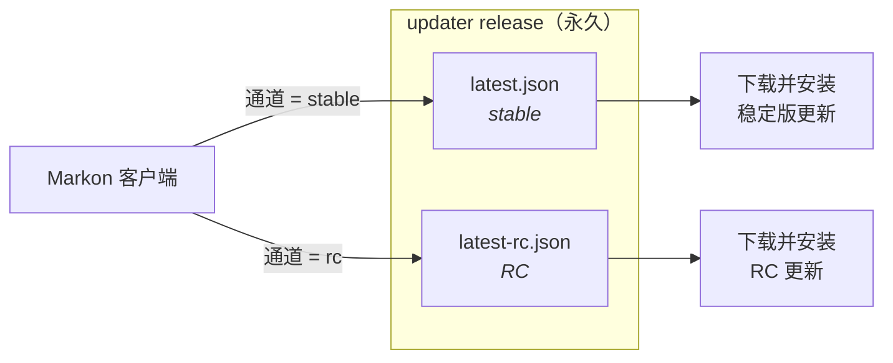

# 发布流程

Markon 采用双通道（RC / Stable）发布模型，全流程 CI/CD 自动化。

## 总览


```mermaid
flowchart TD
    A0["带标签的 PR 合并进 main"] --> A["Auto Bump<br/>(auto-bump.yml)<br/>写入 Cargo.toml 版本号"]
    A --> B["Auto RC<br/>(auto-rc.yml)"]
    B --> C["打 Tag: v0.13.0-rc.1"]
    C --> D["gh workflow run release.yml<br/><i>dispatch 触发</i>"]
    D --> E["Release<br/>(release.yml)"]
    E --> F["六目标构建<br/>macOS / Linux / Windows × (x86_64 + aarch64)"]
    F --> G["签名 updater 归档"]
    G --> H["发布为 prerelease"]
    H --> I["上传 latest-rc.json<br/>到 updater release"]

    I --> J{{"满 7 天的最新 RC<br/>无 non-release"}}
    J --> K["Auto Promote<br/>(auto-promote.yml, 每日定时)"]
    K --> L["Promote<br/>(promote.yml)"]
    L --> M["复制 RC 资产 → 创建 stable release v0.13.0"]
    M --> N["上传 latest.json<br/>到 updater release"]
    N --> P["发布 markon-core + markon<br/>到 crates.io"]

    style A0 fill:#8b5cf6,color:#fff
    style A fill:#4a9eff,color:#fff
    style E fill:#f59e0b,color:#fff
    style L fill:#10b981,color:#fff
    style J fill:#f3f4f6,color:#333
    style P fill:#ef4444,color:#fff
```

> **为什么用 dispatch？** GitHub Actions 内置的 `GITHUB_TOKEN` 推送 tag 时不会触发其他 workflow。
> Auto RC 通过 `gh workflow run release.yml` 直接调用来绕过这一限制。

## Workflow 一览


```mermaid
graph LR
    subgraph "每次 push / PR 到 main"
        CI["ci.yml<br/>test / clippy / fmt<br/>package / vitest / eslint"]
    end

    subgraph "PR 合并时"
        AB["auto-bump.yml"]
    end

    subgraph "Cargo.toml 版本变更时"
        RC["auto-rc.yml"] -->|dispatch| REL["release.yml"]
    end

    subgraph "每日 08:00 UTC 定时任务"
        AP["auto-promote.yml"] -->|dispatch| PR["promote.yml"]
    end

    AB -->|"推送版本号变更"| RC
    REL -->|"prerelease<br/>+ latest-rc.json"| UP["updater release"]
    PR -->|"stable release<br/>+ latest.json"| UP
```

| Workflow | 触发方式 | 用途 |
|----------|---------|------|
| `ci.yml` | push / PR 到 main | test + clippy + fmt + 打包 dry-run + vitest + eslint |
| `auto-bump.yml` | PR 以 merged 状态关闭（目标 main） | 读取 PR 标签 → 修改 `Cargo.toml` 版本号 → 推送到 main |
| `auto-rc.yml` | push main 且 Cargo.toml 变更 | 检测版本变化 → 打 RC tag → 触发 Release |
| `release.yml` | `workflow_dispatch` 或 tag push `v*` | 构建 + 签名 + 发布 + 上传 updater manifest |
| `auto-promote.yml` | 每日 08:00 UTC 定时 + 手动 | 检查 RC 时间和 blocker → 触发 Promote |
| `promote.yml` | `workflow_dispatch`（由 auto-promote 或手动触发） | 复制 RC 资产 → 创建 stable release → 更新 manifest → 发布到 crates.io |
| `docs.yml` | push main 触及 `docs/**` 或 stable `release` 事件 | 构建 VitePress 站点并部署到 GitHub Pages |

## 如何发布

### 1. 给 Pull Request 打标签

没有 bump 命令要跑。版本号一律不手写，由 `auto-bump.yml` 从你合并的那个 PR 的
标签推导而来——发版决定因此记录在 PR 上，事后可查。

| 标签 | 对 `0.15.19` 的效果 | 什么时候用 |
|------|--------------------|-----------|
| `semver:breaking` | → **`0.16.0`** | 命令行参数删改、配置或 lock 格式变更、`markon-core` 公开 API 变更——任何需要现有用户做出反应的改动 |
| `semver:patch` | → **`0.15.20`** | 修复、新功能、依赖升级。与不打标签完全等价，打上它只是为了表态"我看过了，确实是修订级" |
| *（不打标签）* | → **`0.15.20`** | 默认行为，保证 Dependabot 之类机器人开的 PR 不会卡住流水线 |
| `release:skip` | **不改版本，不发版** | 纯文档、纯 CI、纯测试改动，没人需要为它出一个构建 |

优先级：`release:skip` > `semver:breaking` > 其余。

**1.0 之前的映射规则。** 主版本号还是 `0` 时，破坏性变更抬的是**中间位**——
`0.15.19 → 0.16.0`，而不是 `1.0.0`——因为主版本 `0` 本身已经表示"不承诺稳定"。
新功能和修复都落在修订位。项目到达 `1.0` 时这套映射需要重新制定。

> **`release:skip` 比看起来重要。** 因为不打标签默认按修订级处理，
> **每个**合并的 PR 都会切出一个新版本——改一个 README 错别字也会。
> 记得给这类无需发版的改动打上它。

合并 PR 就是全部动作。随后 `auto-bump.yml` 会改写 `workspace.package.version`
（中间位变动时同步改 `markon-core` 的 `MAJOR.MINOR` 依赖范围），用
`cargo metadata` 刷新 `Cargo.lock`，然后在 `release/bump-<版本>` 分支上开一个
`chore: bump to <版本>` 的 PR 并挂上 auto-merge。必需检查一过它自己合并，
这次合并就是 `auto-rc.yml` 在等的那个 push。

> **没有任何人能直接写 main。** 版本号不行，tap 更新不行，管理员也不行。
> 分支保护开启了「包含管理员」，所以每一次改动——人的还是机器人的——
> 都必须经由一个通过了必需检查的 PR。`RELEASE_PUSH_TOKEN` 依然需要，
> 但不是用来绕过任何东西：用内置 `GITHUB_TOKEN` 开的 PR 不会触发 CI，
> auto-merge 就会永远等一个不会开始的检查。这个 PAT 只是让 PR 看起来像人开的。

> **这个 bump PR 打了 `release:skip`**，并且 `auto-bump.yml` 还会忽略一切
> 以 `release/` 开头的已合并分支。没有这两道保险，合并一次版本号变更
> 就会触发下一次版本号变更，无限循环。

### 2. 自动化流程


```mermaid
sequenceDiagram
    participant Dev as 开发者
    participant GH as GitHub
    participant RC as auto-rc
    participant Rel as release
    participant AP as auto-promote
    participant Prom as promote

    Dev->>GH: push（Cargo.toml 版本变更）
    GH->>RC: 触发
    RC->>GH: git tag v0.13.0-rc.1 && git push
    RC->>Rel: gh workflow run release.yml
    Rel->>GH: 构建六目标
    Rel->>GH: 发布 prerelease + latest-rc.json

    Note over AP: 每日 08:00 UTC 定时
    AP->>GH: RC 发布满 7 天？
    AP->>GH: 无 non-release issue？
    AP->>Prom: gh workflow run promote.yml
    Prom->>GH: 复制资产 → stable release
    Prom->>GH: 上传 latest.json
```

1. **auto-rc.yml** 检测版本变化，创建 tag `v0.13.0-rc.1`，dispatch 触发 Release
2. **release.yml** 构建六目标（macOS / Linux / Windows 各自 x86_64 + aarch64），签名 updater 归档，创建 prerelease，上传 `latest-rc.json` 到永久的 `updater` release
3. **auto-promote.yml** 每天 08:00 UTC 运行，选出「已满 7 天里最新的 RC」并校验晋升条件（见下），满足则 dispatch 触发 Promote
4. **promote.yml** 复制 RC 全部资产到新的 stable release `v0.13.0`，上传 `latest.json`

### 3. 自动晋升条件

每天选出**满 7 天的 RC 里最新的那个**，满足以下两条即晋升：

- 比当前最新 stable 更新（不倒退、不重发）
- 无 `non-release` 标签的 open issue

> 取「满 7 天里最新」而非「绝对最新」：否则高频发版时新 RC 永远没满 7 天，crates.io 会一直停在旧版（0.13.x 曾因此卡住一个月）。详细取舍见 `auto-promote.yml` 注释。

### 4. 阻止发布

给任意 open issue 添加 `non-release` 标签即可阻止自动晋升。这是手动决策——发现严重 bug 时添加，修复后移除标签（或关闭 issue）。

### 5. 手动操作

跳过 7 天等待，立即晋升：

```bash
gh workflow run promote.yml -f rc_tag=v0.13.0-rc.1
```

同版本发新 RC（如 hotfix 后版本号不变）：

```bash
# auto-rc 仅在版本号变更时触发，同版本需手动打 tag：
git tag v0.13.0-rc.2
git push origin v0.13.0-rc.2
# 然后手动触发构建：
gh workflow run release.yml -f tag=v0.13.0-rc.2
```

### 6. 发布到 crates.io

在 `promote.yml` 晋升 stable 后**自动触发**——创建完 GitHub stable release，
末尾的 `publish-crates` job 按顺序将 `markon-core` 和 `markon` 发布到 crates.io，
用户即可通过 `cargo install markon` 安装。

需要在 GitHub 仓库 Secrets 中配置 `CARGO_REGISTRY_TOKEN`。未配置时 job 会发出
warning 并跳过（不影响 release 本身，方便 fork 和首次配置）。重跑幂等：
如果版本已在 crates.io 上，job 视为成功。

`markon-gui` 标记了 `publish = false`，仅通过 GitHub Release 分发。

没有本地发布脚本。`promote.yml` 是通往 crates.io 的唯一路径，因此不可能从一份
CI 没检查过的工作区发出版本。发布失败时重跑该 workflow 即可——它是幂等的。

### 7. Homebrew / Scoop 自动更新

`Casks/markon.rb`（Homebrew）和 `bucket/markon.json`（Scoop）就在本仓库里，
兼作个人 tap。`promote.yml` 在晋升 stable 时会更新它们的版本号与安装包 SHA，
并提交回 `main`。

更新会以 `release/taps-<版本>` 分支开成 PR 并挂上 auto-merge，打了
`release:skip` 标签——刷新 tap 不应该再切出一个新版本。它需要 Secret
**`RELEASE_PUSH_TOKEN`**（fine-grained PAT，需要 `Contents: Read and write`
加 `Pull requests: Read and write`），因为用内置 `GITHUB_TOKEN` 开的 PR
不会触发 CI，也就永远不会自动合并。未配置该 secret 时会发出 warning 并跳过
（不导致 job 失败）。

`auto-bump.yml` 出于同样理由使用同一个 secret，但它在缺失时**不跳过**：
那里没有 token 就意味着版本号不变，进而没有 RC、完全不会发版，
所以该 job 会直接报错失败，而不是悄悄放过。

## 更新通道

客户端从 GitHub 上一个固定的 `updater` release 检查更新：

| 通道 | Manifest 文件 | 受众 |
|------|-------------|------|
| **Stable**（默认） | `updater/latest.json` | 所有用户 |
| **RC** | `updater/latest-rc.json` | 尝鲜测试用户 |

用户在 设置 -> 偏好设置 -> 更新通道 中切换。


```mermaid
flowchart LR
    subgraph "updater release（永久）"
        LJ["latest.json<br/><i>stable</i>"]
        LR["latest-rc.json<br/><i>RC</i>"]
    end

    APP["Markon 客户端"] -->|"通道 = stable"| LJ
    APP -->|"通道 = rc"| LR
    LJ --> DL1["下载并安装<br/>稳定版更新"]
    LR --> DL2["下载并安装<br/>RC 更新"]
```

### 客户端更新行为

- 应用空闲时检查对应通道的 updater manifest
- 发现新版本后自动下载并安装
- 关于页面显示「更新完成，重启生效」及「立即重启」链接
- 用户不重启的话，更新在下次启动时生效

## 签名

Updater 包使用 minisign 密钥对签名：

- **公钥**：内嵌在 `crates/gui/tauri.conf.json` -> `plugins.updater.pubkey`
- **私钥**：GitHub Secret `TAURI_SIGNING_PRIVATE_KEY`（无密码）

重新生成：

```bash
cargo tauri signer generate -w ~/.tauri/markon.key -p "" --ci
# 更新 tauri.conf.json 中的 pubkey
# 更新 GitHub Secret TAURI_SIGNING_PRIVATE_KEY
```

## 构建优化

- **Rust 缓存**：`Swatinem/rust-cache` 跨构建缓存依赖（7 天 TTL）
- **cargo-binstall**：直接下载预编译的 `tauri-cli`，跳过源码编译
- **Release profile**：`strip = true`、`lto = true`、`codegen-units = 1`、`opt-level = "s"`
