# Diagram Gallery

This page exercises Supramark diagram rendering and unsupported diagram source fallback behavior. It also includes the search token `MARKON_E2E_DIAGRAM_SEARCH_TOKEN`.

## Mermaid Flowchart

Mermaid flowchart target.

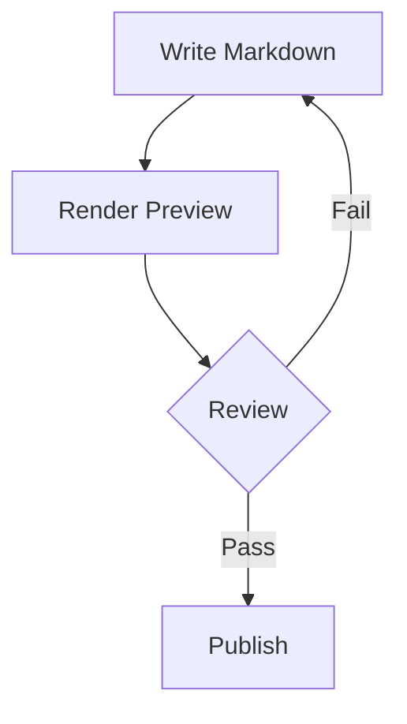

## Mermaid Sequence Diagram

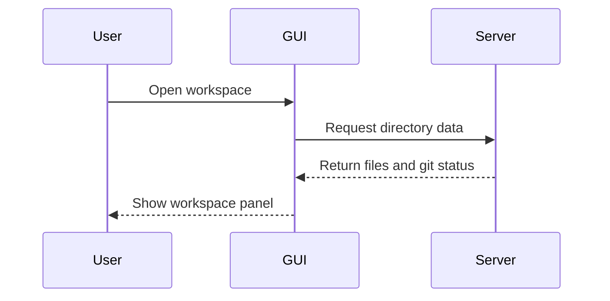

## Mermaid Class Diagram

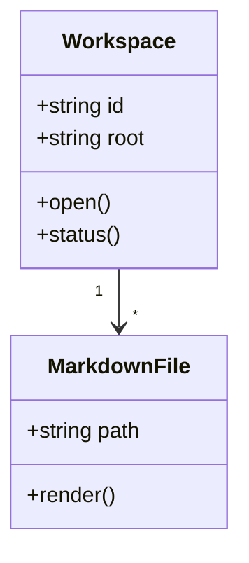

## Mermaid State Diagram

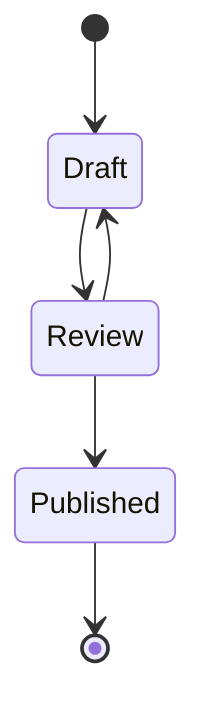

## Mermaid Entity Relationship Diagram

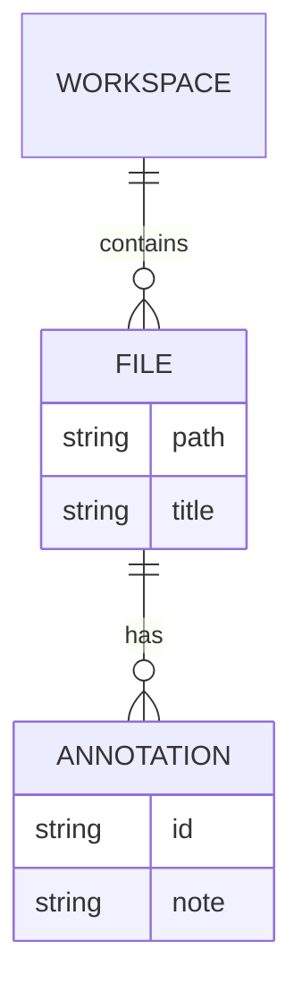

## Mermaid User Journey

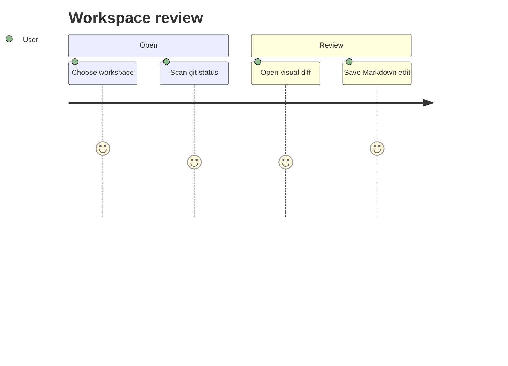

## Mermaid Gantt Chart

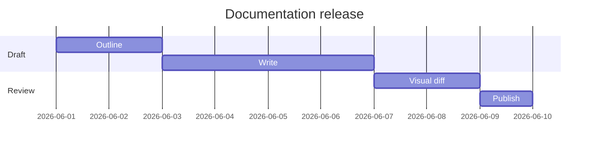

## Mermaid Pie Chart

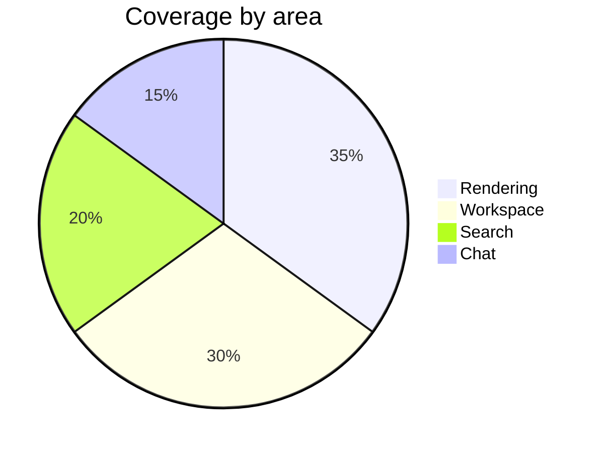

## Mermaid Mindmap

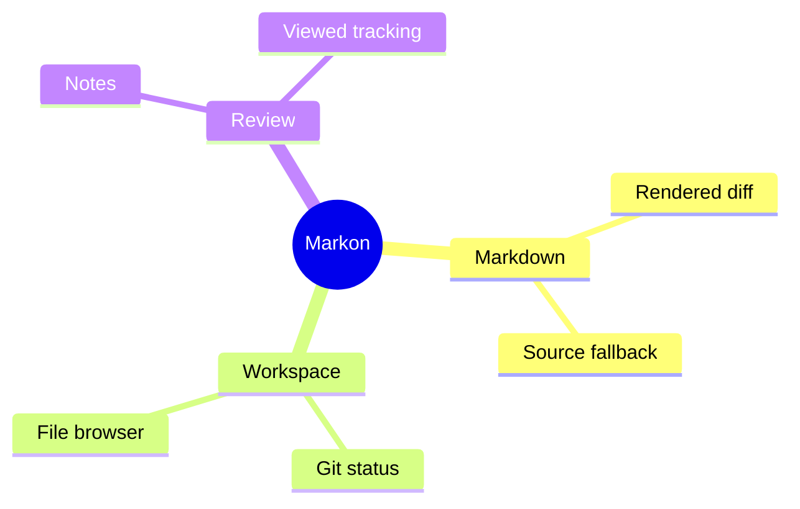

## Mermaid Timeline

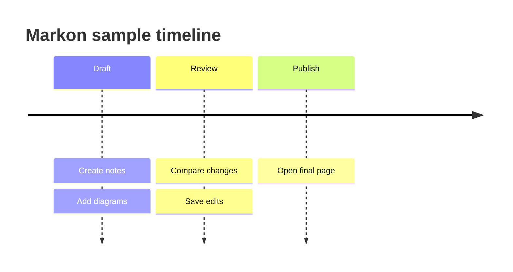

## Mermaid Git Graph

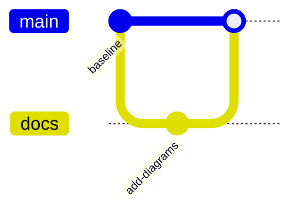

## Rendered Diagram: Graphviz DOT

Graphviz DOT target.

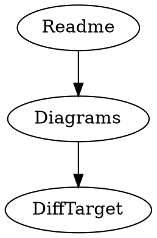

## Rendered Diagram: Graphviz Alias

Graphviz alias target.

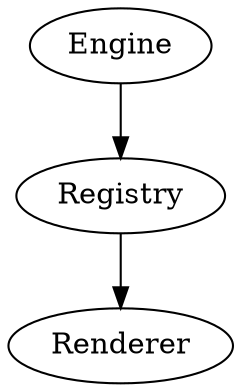

## Rendered Diagram: PlantUML

PlantUML sequence target.

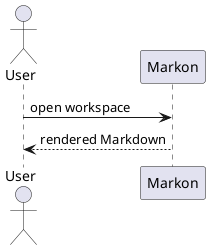

## Rendered Diagram: D2

D2 diagram target.

```d2
workspace: Workspace
markdown: Markdown files
review: Visual review
workspace -> markdown
markdown -> review
```

## Rendered Diagram: Vega-Lite

Vega-Lite chart target.

```vega-lite
{
  "data": {
    "values": [
      {"area": "Rendering", "score": 35},
      {"area": "Workspace", "score": 30},
      {"area": "Search", "score": 20}
    ]
  },
  "mark": "bar",
  "encoding": {
    "x": {"field": "area", "type": "nominal"},
    "y": {"field": "score", "type": "quantitative"}
  }
}
```

## Rendered Diagram: Vega Alias

Vega alias line chart target.

```vega
{
  "title": {"text": "Vega alias trend"},
  "data": {
    "values": [
      {"stage": "Draft", "score": 12},
      {"stage": "Review", "score": 28},
      {"stage": "Publish", "score": 34}
    ]
  },
  "mark": "line",
  "encoding": {
    "x": {"field": "stage", "type": "nominal"},
    "y": {"field": "score", "type": "quantitative"}
  }
}
```

## Rendered Diagram: Chart Alias

Chart alias scatter target. This alias uses the Supramark Vega-Lite renderer.

```chart
{
  "title": "Chart alias scatter",
  "data": {
    "values": [
      {"item": "A", "score": 8},
      {"item": "B", "score": 14},
      {"item": "C", "score": 22}
    ]
  },
  "mark": "point",
  "encoding": {
    "x": {"field": "item", "type": "nominal"},
    "y": {"field": "score", "type": "quantitative"}
  }
}
```

## Rendered Diagram: ECharts

ECharts chart target.

```echarts
{
  "xAxis": {"type": "category", "data": ["Render", "Search", "Edit"]},
  "yAxis": {"type": "value"},
  "series": [{"type": "line", "data": [35, 20, 25]}]
}
```

## Rendered Diagram: ECharts Pie

ECharts pie chart target.

```echarts
{
  "title": {"text": "Workspace attention"},
  "series": [{
    "type": "pie",
    "data": [
      {"name": "Writing", "value": 42},
      {"name": "Review", "value": 33},
      {"name": "Search", "value": 25}
    ]
  }]
}
```

## Rendered Diagram: Chart.js

Chart.js doughnut chart target.

```chartjs
{
  "type": "doughnut",
  "data": {
    "labels": ["Markdown", "Workspace", "Review"],
    "datasets": [{"data": [40, 35, 25]}]
  }
}
```

## Rendered Diagram: Chart.js Alias

Chart.js alias line chart target.

```chart.js
{
  "type": "line",
  "data": {
    "labels": ["Draft", "Review", "Launch"],
    "datasets": [{
      "label": "Readiness",
      "data": [72, 91, 100]
    }]
  },
  "options": {
    "plugins": {
      "title": {
        "text": "Release readiness"
      }
    }
  }
}
```

## Unsupported Diagram Fallback: Plotly

This block intentionally remains a labeled source fallback because Plotly is not registered in the Rust Supramark diagram registry.

```plotly
{
  "data": [{"type": "bar", "x": ["A", "B"], "y": [1, 2]}]
}
```
