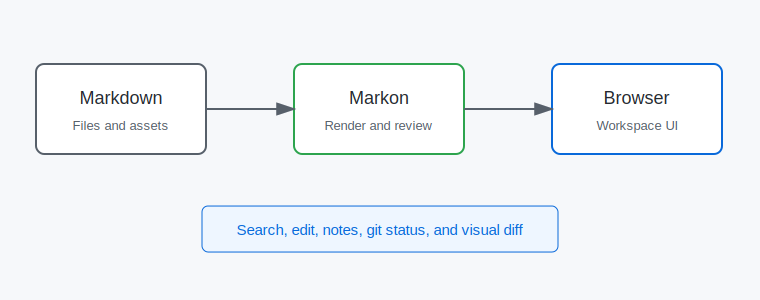

# Markdown Kitchen Sink

This page covers common Markdown features used by normal Markon projects. It is intentionally dense so visual regressions are easy to spot.

Setext Heading Target
=====================

The setext heading above should render as a normal heading and appear in the table of contents.

## Inline Formatting

Plain text can include **strong text**, *emphasis*, `inline code`, ~~deleted text~~, and a link to [the workspace home](../README.md).

Emoji shortcode target: :smile: :rocket: :warning:

Inline math target: Energy is $E = mc^2$.

Reference link target: [Reference documentation][fixture-reference].

Autolink target: <https://example.com/markon-fixture>

Hard break target: first line  
second line should start after a hard break.

[fixture-reference]: ../README.md "Workspace README"

## GitHub Alerts

> [!NOTE]
> GitHub alert rendering target: this note should render as a styled alert, not as a plain blockquote.

> [!TIP]
> Use this workspace as a stable fixture for screenshot tests.

> [!IMPORTANT]
> Workspace data should remain local and deterministic.

> [!WARNING]
> This warning is only sample content for visual review.

> [!CAUTION]
> This caution block should keep the same CSS structure as the other alerts.

## Lists and Tasks

- First unordered item
- Second unordered item
  - Nested item
  - Nested item with `code`

1. First ordered item
2. Second ordered item
3. Third ordered item

- [x] Task list target: baseline task is complete
- [ ] Task list target: pending task is visible

## Tables

| Component | Status | Coverage |
| :--- | :---: | ---: |
| Renderer | Stable | 95% |
| Search | Ready | 88% |
| Workspace git | In progress | 72% |

## Images and Breaks



Thematic break target follows.

---

## Code Fences

```rust
fn main() {
    let message = "Markon E2E";
    println!("{message}");
}
```

```typescript
type WorkspaceStatus = "ready" | "review";
const status: WorkspaceStatus = "ready";
console.log(status);
```

```python
def summarize(values):
    return {"count": len(values), "total": sum(values)}
```

```toml
[workspace]
name = "markon-e2e"
mode = "fixture"
```

```protobuf
message WorkspaceEvent {
  string id = 1;
  string path = 2;
}
```

## Math Block

$$
\sum_{i=1}^{n} i = \frac{n(n+1)}{2}
$$

## Footnotes

Footnote reference target[^fixture-note] should link to the normalized definition id.

[^fixture-note]: This footnote exists to verify footnote rendering and navigation.

## Definition List

Definition list target
: A term and description pair that should render as `dl`, `dt`, and `dd`.

Workspace fixture
: A reusable directory that can be copied into a temporary test location.

## Raw HTML

<div class="e2e-panel" data-testid="raw-html-panel">
  <strong>Raw HTML panel target</strong>
  <p>This block verifies raw HTML passthrough and local CSS loading.</p>
</div>

## Unsupported Supramark Extension Fallback

These opaque extension blocks are intentionally rendered as labeled source fallback in Markon today.

:::map
center: [37.7749, -122.4194]
zoom: 12
marker:
  lat: 37.7749
  lng: -122.4194
  label: Markon fixture
:::

%%%form review
name: Reviewer
decision: pending
%%%
