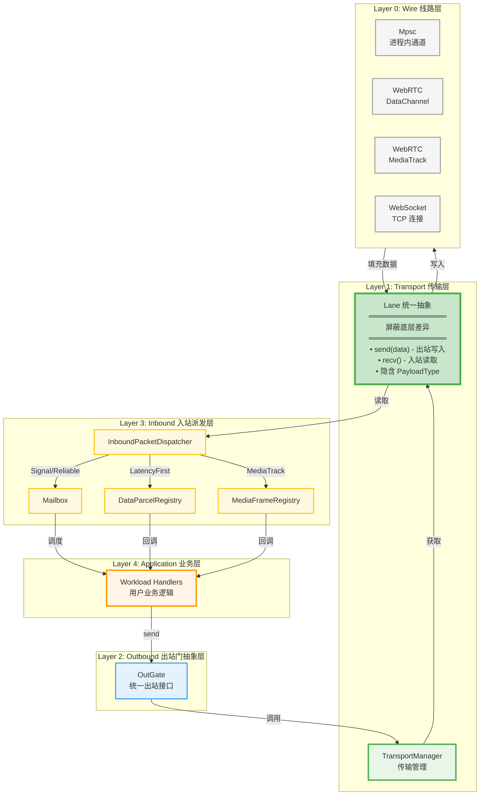

# actr-runtime 架构文档

## 架构分层（自底向上）

```mermaid
graph TB
    subgraph L4["Layer 4: Application 业务层"]
        WH["Workload Handlers<br/>用户业务逻辑"]
    end

    subgraph L3["Layer 3: Inbound 入站派发层"]
        MR["InboundPacketDispatcher"]
        MB["Mailbox"]
        DPR["DataParcelRegistry"]
        MFR["MediaFrameRegistry"]

        MR -->|Signal/Reliable| MB
        MR -->|LatencyFirst| DPR
        MR -->|MediaTrack| MFR
    end

    subgraph L2["Layer 2: Outbound 出站门抽象层"]
        OG["OutGate<br/>统一出站接口"]
    end

    subgraph L1["Layer 1: Transport 传输层"]
        TM["TransportManager<br/>传输管理"]

        LANE["Lane 统一抽象<br/>═══════════════<br/>屏蔽底层差异<br/>═══════════════<br/>• send(data) - 出站写入<br/>• recv() - 入站读取<br/>• 隐含 PayloadType"]
    end

    subgraph L0["Layer 0: Wire 线路层"]
        direction LR
        MPSC["Mpsc<br/>进程内通道"]
        DC["WebRTC<br/>DataChannel"]
        MT["WebRTC<br/>MediaTrack"]
        WS["WebSocket<br/>TCP 连接"]
    end

    %% 出站流向（从上到下）
    WH -->|send| OG
    OG -->|调用| TM
    TM -->|获取| LANE
    LANE -->|写入| L0

    %% 入站流向（从下到上）
    L0 -->|填充数据| LANE
    LANE -->|读取| MR
    MB -->|调度| WH
    DPR -->|回调| WH
    MFR -->|回调| WH

    classDef app fill:#fff4e6,stroke:#ff9800,stroke-width:3px
    classDef router fill:#fff8e1,stroke:#ffc107,stroke-width:2px
    classDef gate fill:#e3f2fd,stroke:#2196f3,stroke-width:2px
    classDef transport fill:#e8f5e9,stroke:#4caf50,stroke-width:3px
    classDef lane fill:#c8e6c9,stroke:#4caf50,stroke-width:4px
    classDef wire fill:#f5f5f5,stroke:#9e9e9e,stroke-width:2px

    class WH app
    class MR,MB,DPR,MFR router
    class OG gate
    class TM transport
    class LANE lane
    class MPSC,DC,MT,WS wire
```
