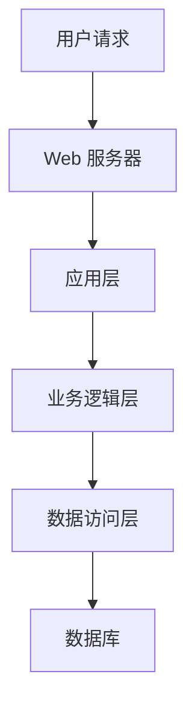
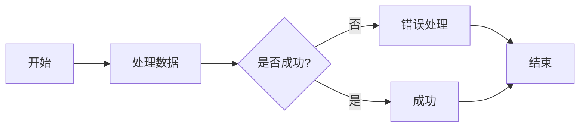
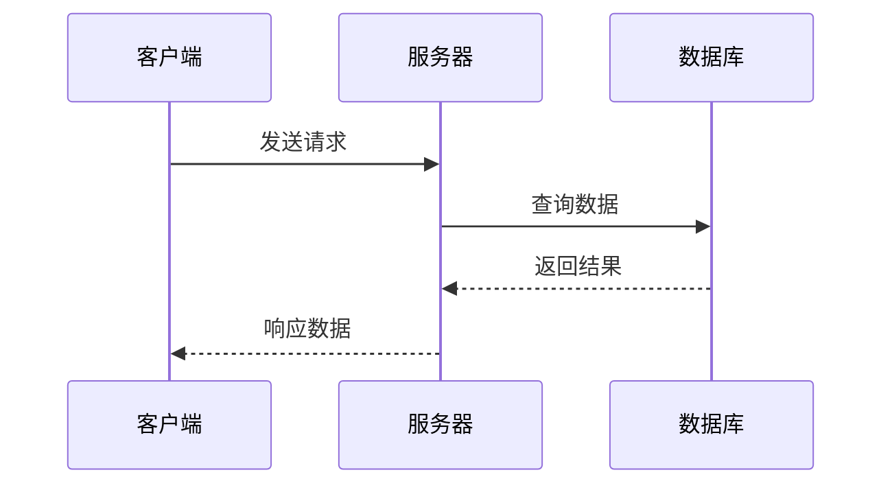

# 测试 Mermaid 打印

这是一个用于测试 Mermaid 图表打印功能的文档。

## 架构分层

以下是一个简单的架构图：

```mermaid
graph TD
    A[用户请求] --> B[Web 服务器]
    B --> C[应用层]
    C --> D[业务逻辑层]
    D --> E[数据访问层]
    E --> F[数据库]
```

## 流程图示例

```mermaid
graph LR
    Start[开始] --> Process[处理数据]
    Process --> Decision{是否成功?}
    Decision -->|是| Success[成功]
    Decision -->|否| Error[错误处理]
    Error --> End[结束]
    Success --> End
```

## 时序图

```mermaid
sequenceDiagram
    participant 客户端
    participant 服务器
    participant 数据库

    客户端->>服务器: 发送请求
    服务器->>数据库: 查询数据
    数据库-->>服务器: 返回结果
    服务器-->>客户端: 响应数据
```

这些图表应该在打印时显示完整，包括箭头。
